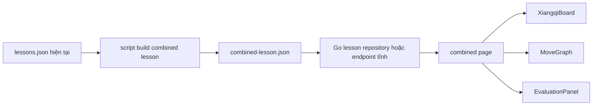

# Trang Gộp Toàn Bộ Lesson

## Bối Cảnh

Ứng dụng hiện có catalog lesson tương tác: API Go đọc `apps/api/data/lessons/lessons.json`, trả về danh sách bài học và chi tiết từng lesson; frontend Vue hiển thị sidebar bài học, topbar tiêu đề, bàn cờ, cây nước đi và panel engine. Docs hiện tại mô tả trạng thái này ở `docs/features/lesson-experience.md` và đang được đánh dấu synced trong `docs/_sync.md`.

Yêu cầu mới là có một script để gộp toàn bộ lesson thành một lesson chung cho một page mới. Page mới không cần trải nghiệm đọc catalog, không có left sidebar và không có topbar; chỉ giữ ba khối vận hành chính: bàn cờ, graph và engine.

Trong worktree hiện tại đã có các thay đổi liên quan extract/merge lesson và engine UI. Kế hoạch này giả định các thay đổi đó là bối cảnh đang phát triển, không đảo hoặc ghi đè chúng.

## Nguyên Nhân Và Lý Do Thiết Kế

Triệu chứng hiện tại là mỗi lesson tồn tại như một đơn vị riêng biệt, nên muốn duyệt dữ liệu lớn phải đi qua catalog hoặc route `/lessons/{id}` từng bài. Điều đó phù hợp với học theo chủ đề, nhưng không phù hợp với một page chuyên phân tích toàn bộ tập lesson như một graph lớn.

Nguyên nhân trực tiếp là contract hiện tại của `Lesson` chỉ có `lines` bên trong một lesson; frontend `useLessonPlayer`, `MoveGraph`, `XiangqiBoard` và `EvaluationPanel` đều xoay quanh một lesson đang active. Muốn page mới chỉ có board, graph và engine thì cần một nguồn lesson tổng hợp duy nhất để các component hiện có có thể đọc mà không phải biết về catalog.

Nguyên nhân gốc rễ là dữ liệu và UI đang dùng cùng một đơn vị điều hướng: lesson vừa là đơn vị học, vừa là đơn vị render graph. Page mới cần tách hai khái niệm này: catalog vẫn giữ từng lesson riêng, còn page tổng hợp dùng một artifact được sinh ra từ toàn bộ catalog.

Hướng thiết kế nên ưu tiên sinh dữ liệu tổng hợp bằng script thay vì làm frontend tải 811 lesson detail rồi merge runtime. Lý do là API list hiện chỉ trả summary, route detail trả từng lesson, và merge runtime sẽ tạo nhiều request, khó kiểm chứng, khó cache, dễ làm page chậm khi số lesson tăng.

## Góc Nhìn Tổng Quan Và Phạm Vi Tập Trung

Phạm vi tập trung gồm:

- Script tạo lesson tổng hợp từ `apps/api/data/lessons/lessons.json`.
- API phục vụ lesson tổng hợp như một lesson detail bình thường hoặc qua endpoint/page id ổn định.
- Frontend route/page mới dùng lại player, board, graph và engine panel, nhưng bỏ sidebar, topbar, choice UI và principles.
- Validation để đảm bảo dữ liệu tổng hợp vẫn đúng schema compact hiện tại.

Không cần thay đổi luật đi quân, engine UCI, schema lesson public cho lesson thường, hoặc pipeline extract external.

## Mục Tiêu

- Có script lặp lại được để đọc toàn bộ lesson hiện có và sinh một lesson chung.
- Lesson chung có `id`, `title`, `category`, `difficulty`, `lines`, `choice` đúng contract hiện tại.
- Mỗi lesson gốc trở thành một hoặc nhiều line trong lesson chung, để `MoveGraph` có thể hiển thị toàn bộ corpus.
- Page mới có route ổn định, ví dụ `/combined` hoặc `/lessons/all`, render chỉ bàn cờ, graph và engine.
- Catalog/page hiện tại vẫn hoạt động như cũ.

## Ngoài Phạm Vi

- Không merge staging external vào production lesson catalog trong task này.
- Không tạo hệ thống router phức tạp nếu route detection đơn giản trong `App.vue` đủ dùng.
- Không thiết kế lại `MoveGraph` thành graph semantic thật sự giữa các lesson khác initial FEN.
- Không thêm search/filter nâng cao cho page tổng hợp ở lượt đầu.
- Không thay đổi response shape `{ "error": "..." }` của API phân tích.

## Logic Nghiệp Vụ

Script gộp lesson cần coi mỗi lesson gốc là dữ liệu đầu vào bất biến. Đầu ra là một lesson tổng hợp có các line độc lập:

- Nếu lesson gốc có một line, line đó được đưa vào lesson tổng hợp.
- Nếu lesson gốc có nhiều line, mỗi line gốc được đưa vào như một line riêng, với title chứa tên lesson và tên biến để người xem phân biệt.
- Nếu lesson gốc có `initialFen`, line tổng hợp phải giữ được vị trí bắt đầu tương ứng. Vì schema hiện tại chỉ cho phép một `initialFen` ở cấp lesson, không thể trộn các line có initial FEN khác nhau vào cùng một lesson mà vẫn replay đúng.

Do ràng buộc `initialFen` cấp lesson, script cần chọn một trong hai chiến lược:

1. Chỉ gộp các lesson dùng cùng initial position. Đây là phương án an toàn nhất cho schema hiện tại.
2. Sinh nhiều lesson tổng hợp theo nhóm initial position. Page mới có thể chọn nhóm mặc định hoặc hiển thị từng nhóm sau này.

Để đúng với yêu cầu "một lesson chung", đề xuất lượt đầu dùng một lesson chung cho nhóm standard initial position, đồng thời report rõ số lesson bị bỏ qua vì có `initialFen` riêng. Nếu muốn bao phủ tuyệt đối toàn bộ lesson, cần mở rộng schema line để có `initialFen` cấp line hoặc tạo page tổng hợp nhiều group.

## Cấu Trúc Giải Pháp

## Hướng Tiếp Cận Đề Xuất

### Script

Tạo script riêng, ví dụ `scripts/build_combined_lesson.py`, thay vì nhét vào `merge_staging.py`. Script merge staging đang có mục tiêu khác: import an toàn staging vào production catalog. Script mới nên có trách nhiệm hẹp hơn: tạo artifact đọc được bởi app.

Input mặc định:

- `apps/api/data/lessons/lessons.json`

Output mặc định:

- `apps/api/data/lessons/combined-lesson.json`

Các option nên có:

- `--input`
- `--output`
- `--id`
- `--title`
- `--dry-run`
- `--include-initial-fen`, nếu sau này quyết định hỗ trợ nhiều nhóm hoặc schema mới

Script cần tạo UUID ổn định, không random mỗi lần chạy, để diff sạch và route ổn định. Có thể dùng UUID v5 từ namespace cố định + source lesson id/line id. Move id có thể giữ nguyên nếu bảo đảm unique toàn catalog; nếu không, cũng dùng UUID v5 cho line/move tổng hợp.

### Backend

Có hai hướng:

- Ít thay đổi nhất: repository load thêm `combined-lesson.json` như một lesson đặc biệt khi file tồn tại.
- Rõ boundary hơn: thêm endpoint `GET /api/combined-lesson` đọc artifact tổng hợp.

Đề xuất dùng endpoint riêng nếu không muốn combined lesson xuất hiện trong catalog thường. Nếu muốn route mới vẫn dùng helper `fetchLesson`, có thể cho frontend gọi `fetchCombinedLesson()` dùng endpoint riêng nhưng trả cùng type `Lesson`.

### Frontend

Tách phần render board/graph/engine ra khỏi `App.vue` thành một component dùng chung, ví dụ:

- `LessonWorkspace.vue`: nhận `lesson`, render board controls, `XiangqiBoard`, `MoveGraph`, `EvaluationPanel`.
- `CatalogLessonPage.vue`: giữ sidebar, topbar, choice UI, principles và dùng `LessonWorkspace` hoặc logic hiện tại được tách vừa đủ.
- `CombinedLessonPage.vue`: load combined lesson, tạo `useLessonPlayer`, `useMoveEvaluation`, render layout tối giản chỉ board, graph, engine.

Nếu muốn giữ scope nhỏ, có thể chưa tạo router dependency; `App.vue` chỉ kiểm tra `window.location.pathname`:

- `/combined` render `CombinedLessonPage`.
- Còn lại render experience hiện tại.

CSS nên thêm layout riêng cho combined page thay vì ép `app-shell` hiện tại, vì `app-shell` đang được thiết kế ba cột có sidebar/topbar.

## Chi Tiết Triển Khai

1. Tạo script build combined lesson.
   - Đọc JSON array lesson.
   - Validate shape tối thiểu: id/title/lines/moves.
   - Chỉ nhận lesson không có `initialFen` hoặc có initial position trùng với standard trong lượt đầu.
   - Flatten từng line gốc thành line tổng hợp.
   - Prefix title line bằng lesson title để graph có ngữ cảnh.
   - Tạo report: tổng lesson đọc, line ghi, lesson skip, lý do skip.

2. Thêm artifact output vào backend data.
   - Quyết định output có commit hay không sau khi script chạy.
   - Nếu output lớn, cân nhắc không commit file sinh ra và chỉ commit script; nhưng page cần data ở runtime nên dev/prod cần bước generate rõ ràng.

3. Backend phục vụ combined lesson.
   - Thêm loader endpoint `GET /api/combined-lesson`.
   - Reuse type `lessons.Lesson`.
   - Trả `404` hoặc `503` rõ nếu file chưa được build.
   - Thêm test HTTP cho endpoint và missing file nếu cần.

4. Frontend page mới.
   - Thêm `fetchCombinedLesson()`.
   - Thêm component/page tối giản.
   - Dùng lại `useLessonPlayer` và `useMoveEvaluation`.
   - Bỏ sidebar, topbar, choice box và principles trên page này.
   - Giữ controls đi nước vì board/graph cần cách tua trạng thái.

5. Tối ưu `MoveGraph` nếu data lớn.
   - Lượt đầu có thể dùng graph hiện tại, nhưng 811+ line có thể rất nặng.
   - Nếu render chậm, thêm giới hạn hoặc lazy/grouping sau, nhưng không nên mở rộng trong cùng task nếu chưa có bằng chứng.

## Công Việc Cần Làm

- Thêm script tạo combined lesson với dry-run và report.
- Thêm API client/backend endpoint cho combined lesson.
- Tách hoặc thêm page frontend tối giản.
- Thêm CSS layout cho combined page.
- Thêm validation mục tiêu: script dry-run, `go test ./apps/api/...`, `npm run build:web`.
- Cập nhật docs feature nếu hành vi mới được triển khai.

## Rủi Ro Và Ràng Buộc

- Ràng buộc lớn nhất là `initialFen` đang nằm ở cấp lesson, nên một lesson chung thật sự không thể replay đúng mọi line nếu các lesson có nhiều vị trí bắt đầu khác nhau.
- Graph hiện tại đặt mọi line trên một canvas; dữ liệu lớn có thể làm page quá rộng/cao hoặc render chậm.
- `useMoveEvaluation` gọi engine theo vị trí active; page tổng hợp nhiều line vẫn ổn, nhưng không nên tự động phân tích hàng loạt.
- Nếu combined lesson được thêm vào catalog thường, nó sẽ xuất hiện trong sidebar cũ và làm trải nghiệm catalog nhiễu. Endpoint riêng tránh rủi ro này.
- Worktree đang có thay đổi chưa commit ở frontend và scripts; khi triển khai cần đọc diff mới nhất và tránh ghi đè thay đổi không thuộc task.

## Kiểm Chứng

- Chạy script với `--dry-run` và xác nhận report hợp lý.
- Chạy script thật và kiểm tra JSON output parse được.
- Chạy `go test ./apps/api/...` để bắt lỗi schema/replay/API.
- Chạy `npm run build:web` để bắt lỗi TypeScript/Vue.
- Mở page mới ở dev server, xác nhận không có sidebar/topbar, chỉ có board, graph, engine và controls cần thiết.
- Kiểm tra một vài node graph: bấm node đổi board đúng, engine chỉ phân tích vị trí active, không spam request khi idle.
