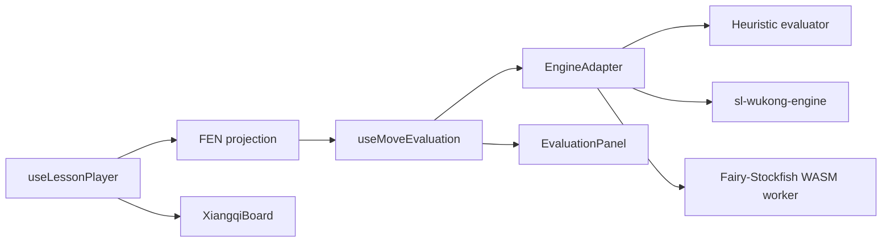

# Tích Hợp Engine Đánh Giá Nước Cờ Tướng

## Bối Cảnh

Ứng dụng hiện là một wiki học cờ tướng bằng Vue, Tailwind và TypeScript. Lesson player đang dựng bàn cờ bằng cách replay các nước trong `src/content/lessons.ts` qua `src/core/xiangqi.ts`. Logic hiện tại chỉ đủ để di chuyển quân theo dữ liệu bài học, chưa có kiểm tra luật đầy đủ, chưa có FEN, chưa có engine, chưa có đánh giá nước đi.

Nhu cầu mới là tìm hiểu thư viện chơi cờ tướng có khả năng đánh giá nước đi và tích hợp vào dự án. Đây là thay đổi có rủi ro kiến trúc vì engine có thể kéo theo worker, WASM, giấy phép GPL, chuẩn FEN/UCI/UCCI, hiệu năng, và đồng bộ state với lesson player.

Các thư viện đã rà soát:

- `sl-wukong-engine`: MIT, TypeScript, có API trực tiếp như `setBoard(fen)`, `generateMoves()`, `makeMove()`, `evaluate()`. Điểm mạnh là nhẹ và đúng nhu cầu MVP. Điểm cần kiểm chứng là metadata repo có dấu hiệu placeholder nên phải smoke test trước khi chọn chính thức.
- `ffish-es6` / `ffish`: GPL-3.0, binding Fairy-Stockfish cho biến thể cờ, hỗ trợ `xiangqi`, có legal moves và FEN. Phù hợp để chuẩn hóa luật/FEN, nhưng không phải một engine phân tích mạnh hoàn chỉnh trong UI theo kiểu best move depth cao.
- `fairy-stockfish-nnue.wasm`: GPL-3.0, engine WASM có NNUE, phù hợp hướng đánh giá mạnh hơn. Đổi lại cần worker, protocol, asset WASM, giới hạn thời gian search, quản lý lifecycle và cân nhắc license.
- `@multi-game-engines/domain-xiangqi` và `@multi-game-engines/adapter-xiangqi`: MIT, mới, thiên về domain model và adapter UCCI. Có thể hữu ích nếu muốn chuẩn hóa giao tiếp engine ngoài, nhưng chưa phải lựa chọn gọn nhất cho UI hiện tại.
- `xiangqii`, `xiang.js`, `xiangqi.ts`: MIT, chủ yếu luật/move generation cơ bản, chưa thấy lớp đánh giá nước rõ bằng engine.
- `xiangqiops`, `elephantops`, `xiangqiground`, `chessgroundx`: có giá trị cho rule/UI, nhưng nhiều gói dùng GPL-3.0 và không trực tiếp giải quyết bài toán đánh giá nước.

Nguồn tham khảo chính:

- `https://www.npmjs.com/package/sl-wukong-engine`
- `https://www.npmjs.com/package/ffish-es6`
- `https://github.com/ianfab/Fairy-Stockfish`
- `https://www.npmjs.com/package/fairy-stockfish-nnue.wasm`
- `https://github.com/fairy-stockfish/fairy-stockfish.wasm`
- `https://www.npmjs.com/package/@multi-game-engines/domain-xiangqi`
- `https://www.npmjs.com/package/@multi-game-engines/adapter-xiangqi`

## Nguyên Nhân Và Lý Do Thiết Kế

Triệu chứng cần giải quyết không chỉ là “thêm thư viện engine”, mà là thêm một tầng phân tích đáng tin cậy lên trên trạng thái bài học hiện có. Nếu engine tự giữ board riêng và UI lesson tự giữ board riêng, trạng thái sẽ rất dễ lệch, nhất là trước đó đã có vấn đề sync giữa lesson và bàn cờ.

Nguyên nhân gốc rễ là dự án chưa có contract chuẩn cho vị trí cờ: hiện chỉ có `BoardState` nội bộ và replay move, chưa có FEN, side-to-move, legal moves hay API phân tích. Engine bên ngoài gần như chắc chắn cần FEN hoặc protocol UCI/UCCI, nên phải thêm một lớp chuyển đổi và adapter thay vì gọi thư viện trực tiếp từ component.

Động lực thiết kế là:

- Giữ lesson player là nguồn sự thật duy nhất cho vị trí đang xem.
- Sinh FEN từ board/playhead hiện tại.
- Đưa mọi thư viện engine vào sau một interface chung.
- Cho phép bắt đầu bằng evaluator nhẹ, sau đó thay bằng engine mạnh mà không viết lại UI.
- Không ràng buộc dự án ngay vào GPL/WASM nếu chưa kiểm chứng nhu cầu và license.

## Góc Nhìn Tổng Quan Và Phạm Vi Tập Trung

Phạm vi tập trung:

- Thiết kế lớp `EngineAdapter` độc lập với UI.
- Thêm chuyển đổi `BoardState` sang Xiangqi FEN.
- Tích hợp đánh giá theo position hiện tại của lesson.
- Hiển thị điểm số, nước gợi ý và nhận xét chất lượng nước trong sidebar hoặc panel cạnh bàn cờ.
- Có cơ chế debounce/cancel để không chạy engine cũ sau khi người học đổi lesson/line/step.
- Smoke test thư viện được chọn trước khi commit phụ thuộc.

Ngoài phạm vi giai đoạn đầu:

- Không xây engine cờ tướng mạnh từ đầu.
- Không cho người dùng đấu tự do với máy ngay.
- Không yêu cầu phân tích sâu nhiều biến nếu chưa có worker ổn định.
- Không thay toàn bộ bàn cờ bằng thư viện UI khác.
- Không đưa package GPL vào bản phân phối nếu chưa chốt được ràng buộc license.

## Mục Tiêu

- Có một panel đánh giá nước đi gắn với trạng thái lesson hiện tại.
- Khi đổi lesson, line hoặc step, engine đánh giá đúng vị trí mới.
- UI hiển thị được score tương đối, best move, độ sâu hoặc nguồn đánh giá nếu có.
- Nếu current/next lesson move có thể so với best move, hiển thị nhận xét như “đúng ý đồ”, “có bẫy”, “cần thận trọng”.
- Kiến trúc cho phép đổi engine từ heuristic sang WASM/UCCI mà ít ảnh hưởng component.
- Build không bị block bởi engine chạy đồng bộ nặng.

## Ngoài Phạm Vi

- Không giải quyết toàn bộ state sync lesson-board trong cùng task, nhưng phải tuân thủ plan `sync-lesson-board-state.md`.
- Không tạo kho dữ liệu khai cuộc engine-generated lớn.
- Không thêm backend.
- Không cam kết engine mạnh ngang app phân tích chuyên nghiệp trong bước đầu.

## Logic Nghiệp Vụ

Mỗi vị trí cần đánh giá dựa trên:

- `lessonId`
- `lineId`
- `ply`
- `board`
- `sideToMove`
- `nextMove` nếu lesson còn nước kế tiếp
- `currentMove` nếu đang cần nhận xét nước vừa đi

Quy tắc side-to-move:

- Nếu `ply = 0`, bên đi là bên của nước đầu tiên trong active line, thường là đỏ.
- Nếu còn `nextMove`, bên đi nên khớp `nextMove.side`.
- Nếu hết line, bên đi có thể suy ra từ nước cuối hoặc để `null` và không chạy best move, chỉ hiển thị kết thúc biến.

Kết quả phân tích nên có dạng:

```ts
interface EngineEvaluation {
  fen: string
  sideToMove: Side
  score: {
    cp?: number
    mate?: number
    perspective: Side
  }
  bestMove?: EngineMove
  principalVariation?: EngineMove[]
  depth?: number
  source: 'uci' | 'wukong' | 'fairy-stockfish'
  status: 'idle' | 'loading' | 'ready' | 'analyzing' | 'error'
  message?: string
}
```

Score cần thống nhất perspective. Đề xuất hiển thị theo bên đang đi hoặc theo đỏ, nhưng trong code phải ghi rõ `perspective` để tránh hiểu ngược.

## Cấu Trúc Giải Pháp

Đề xuất thêm một boundary mới trong `src/engine/`:

- `src/engine/types.ts`: định nghĩa `EngineAdapter`, `EngineEvaluation`, `EngineMove`, `EngineStatus`.
- `src/engine/fen.ts`: chuyển `BoardState` và `sideToMove` sang Xiangqi FEN, parse/format move coordinate nếu cần.
- `src/engine/heuristicEvaluator.ts`: evaluator nội bộ nhẹ, không dependency, dùng làm fallback và baseline.
- `src/engine/wukongAdapter.ts`: adapter thử nghiệm cho `sl-wukong-engine` nếu smoke test đạt.
- `src/engine/fairyStockfishAdapter.ts`: adapter worker/WASM ở phase sau nếu cần phân tích mạnh.
- `src/composables/useMoveEvaluation.ts`: Vue composable nhận lesson player selectors, debounce, cancel và expose evaluation state.
- `src/components/EvaluationPanel.vue`: UI hiển thị score, best move, PV ngắn, trạng thái engine và nhận xét nước lesson.

## Mô Hình C4



## Hướng Tiếp Cận Đề Xuất

Triển khai theo 3 phase để giảm rủi ro:

### Phase 1: Chuẩn Hóa Contract Và Heuristic Fallback

Tạo `EngineAdapter` và `fen.ts`, sau đó thêm evaluator nội bộ dựa trên vật chất và một số tín hiệu đơn giản như chiếu tướng, quân bị ăn, độ cơ động nếu tính được nhẹ. Phase này chưa cần dependency engine, nên ít rủi ro build và license.

Mục tiêu là UI, state sync, lifecycle phân tích và FEN pipeline chạy đúng trước.

### Phase 2: Smoke Test Và Tích Hợp `sl-wukong-engine`

Thử cài `sl-wukong-engine` trong nhánh làm việc, chạy script nhỏ:

- Import được trong Vite/TypeScript.
- `setBoard(fen)` nhận FEN cờ tướng chuẩn.
- `generateMoves()` trả nước hợp lệ.
- `evaluate()` chạy được trên vài vị trí lesson.
- Build production không lỗi.

Nếu đạt, dùng làm engine mặc định vì MIT và API trực tiếp. Nếu không đạt, giữ heuristic và chuyển sang phase engine WASM.

### Phase 3: Engine Mạnh Bằng Worker/WASM

Nếu cần phân tích sâu và best move đáng tin hơn, tích hợp `fairy-stockfish-nnue.wasm` hoặc một engine tương đương qua Web Worker. Adapter phải giao tiếp bất đồng bộ, giới hạn thời gian search, và hủy kết quả cũ khi playhead đổi.

Phase này chỉ nên làm sau khi đã quyết định license GPL phù hợp với cách phát hành dự án.

## Trạng Thái Triển Khai Hiện Tại

Ứng dụng hiện đã chuyển pipeline đánh giá qua Go backend theo plan tách `apps/api` và `apps/web`:

- `apps/web/src/engine/types.ts` giữ contract TypeScript cho evaluation panel.
- `apps/web/src/engine/fen.ts` sinh Xiangqi FEN từ `BoardState` hiện tại để gọi API.
- `apps/web/src/composables/useMoveEvaluation.ts` đọc board/playhead từ `useLessonPlayer`, debounce phân tích, hủy request cũ và gọi `POST /api/analyze`.
- `apps/web/src/components/EvaluationPanel.vue` hiển thị trạng thái engine, score, best move, depth và nhận xét so với nước kế tiếp trong lesson.
- `apps/api/internal/analysis` gọi engine UCI qua `ENGINE_PATH`, parse `info`/`bestmove`, chuẩn hóa score về góc nhìn Đỏ và trả lỗi nếu chưa cấu hình engine.

Ràng buộc hiện tại: `sl-wukong-engine` đã được tháo khỏi frontend bundle. Backend không còn fallback heuristic trong `/api/analyze`; môi trường chạy cần cấu hình một binary UCI cờ tướng như Pikafish bằng `ENGINE_PATH`.

## Chi Tiết Triển Khai

### 1. Thêm FEN Projection

`src/core/xiangqi.ts` đang lưu rank từ đen xuống đỏ, file từ trái sang phải. Xiangqi FEN có thể sinh từ rank `0..9`, mỗi rank gom 9 file, quân đỏ dùng chữ hoa và quân đen dùng chữ thường:

- `general`: `K` / `k`
- `advisor`: `A` / `a`
- `elephant`: `B` / `b`
- `horse`: `N` / `n`
- `chariot`: `R` / `r`
- `cannon`: `C` / `c`
- `soldier`: `P` / `p`

FEN tối thiểu:

```text
<placement> <side> - - 0 <moveNumber>
```

Trong đó `<side>` dùng `w` cho đỏ và `b` cho đen nếu engine/library theo convention Fairy-Stockfish. Cần xác nhận với thư viện được chọn vì một số engine cờ tướng có thể dùng convention riêng.

### 2. Tạo Adapter Interface

Contract nên bất đồng bộ ngay cả khi evaluator đầu tiên chạy sync:

```ts
interface EngineAdapter {
  id: string
  label: string
  analyze(input: EngineAnalyzeInput, signal?: AbortSignal): Promise<EngineEvaluation>
  dispose?(): void
}
```

`EngineAnalyzeInput` gồm FEN, board, side-to-move, next lesson move và giới hạn như `maxDepth` hoặc `timeMs`.

### 3. Tạo `useMoveEvaluation`

Composable này không sở hữu lesson state. Nó chỉ nhận computed từ player:

- board hiện tại
- active line
- ply
- next move
- current move

Khi các giá trị này đổi:

- Hủy request cũ bằng `AbortController`.
- Debounce ngắn khoảng 150-250ms để tránh spam khi bấm next nhanh.
- Set trạng thái `analyzing`.
- Chỉ apply kết quả nếu request vẫn là request mới nhất.

### 4. UI Evaluation Panel

Panel nên đặt trong right sidebar dưới phần chọn lesson/line hoặc cạnh wiki article. Nội dung gọn:

- Trạng thái engine.
- Thanh score hoặc nhãn ưu thế: đỏ tốt hơn, cân bằng, đen tốt hơn.
- Best move bằng tọa độ hoặc notation thô nếu chưa có formatter đẹp.
- So sánh với nước lesson kế tiếp: trùng best move, gần ý tưởng, hoặc khác engine.
- Nguồn đánh giá: `UCI` hoặc `Wukong` nếu sau này thêm lại adapter riêng.

Không nên làm UI như “máy phán tuyệt đối”. Với bài học cờ thế/cạm bẫy, engine score chỉ là tham khảo; nội dung wiki vẫn là lời giải thích chính.

### 5. So Sánh Nước Lesson Với Best Move

Cần helper chuyển move engine sang cùng format `{ from, to }`. Sau đó:

- Nếu `bestMove` cùng `from/to` với `nextMove`, gắn nhãn “Nước khuyến nghị”.
- Nếu khác, hiển thị “Engine đề xuất hướng khác” và không tự kết luận lesson sai.
- Nếu lesson move có `evaluation: 'trap'`, có thể ưu tiên giải thích bẫy thay vì chấm điểm đơn giản.

### 6. License Gate

Trước khi thêm dependency GPL:

- Ghi rõ trong package/plan rằng dự án private hay public.
- Nếu chỉ private learning app, GPL có thể chấp nhận hơn nhưng vẫn phải hiểu nghĩa vụ khi phân phối.
- Nếu muốn public repo/product không vướng GPL, ưu tiên MIT package hoặc self-host engine riêng ngoài bundle.

## Công Việc Cần Làm

1. Thêm `src/engine/types.ts` và chuẩn hóa model phân tích.
2. Thêm `src/engine/fen.ts` cùng unit test hoặc script kiểm tra FEN từ `initialBoard`.
3. Tạo `heuristicEvaluator` để có đánh giá chạy ngay, không phụ thuộc package ngoài.
4. Tạo `useMoveEvaluation` với debounce, cancellation và stale-result guard.
5. Thêm `EvaluationPanel.vue` và gắn vào right sidebar.
6. Smoke test `sl-wukong-engine` trong môi trường Vite.
7. Nếu smoke test đạt, thêm `wukongAdapter` và config chọn engine mặc định.
8. Nếu smoke test không đạt, giữ `/api/analyze` ở trạng thái lỗi cấu hình rõ ràng và tạo phase riêng cho WASM worker hoặc binary UCI khác.
9. Chạy build TypeScript/Vite.
10. Mở app trong browser và kiểm tra đổi lesson/line/step không làm panel đánh giá lệch.

## Rủi Ro Và Ràng Buộc

- Engine GPL có thể ảnh hưởng cách phát hành dự án.
- WASM/worker dễ làm build Vite phức tạp hơn và tăng kích thước bundle.
- Engine mạnh chạy trên main thread sẽ làm UI giật; phải dùng worker nếu search sâu.
- FEN sai orientation sẽ làm engine đánh giá ngược hoặc trả nước vô nghĩa.
- `sl-wukong-engine` có vẻ phù hợp nhất cho MVP nhưng cần kiểm chứng thực tế vì package metadata chưa đủ tin cậy.
- Nếu chưa sửa state sync theo plan riêng, engine panel chỉ nên đọc derived board từ player hiện tại, không thêm board state riêng.

## Kiểm Chứng

- Smoke test FEN initial board khớp placement cờ tướng chuẩn.
- Smoke test vài lesson hiện có: replay không throw, FEN sinh được, side-to-move đúng với `nextMove.side`.
- Với engine UCI: parse được `info depth ... score ... pv ...` và `bestmove`.
- Khi thiếu `ENGINE_PATH`, API trả lỗi cấu hình rõ ràng thay vì hiển thị điểm giả.
- Khi bấm next/previous nhanh, panel không hiện kết quả của position cũ.
- Khi đổi lesson/category/line, panel reset hoặc analyze lại đúng position mới.
- `npm run build` pass.
- Browser kiểm tra desktop/mobile: right sidebar không bị tràn, board vẫn align top, theme switcher không ảnh hưởng panel.
