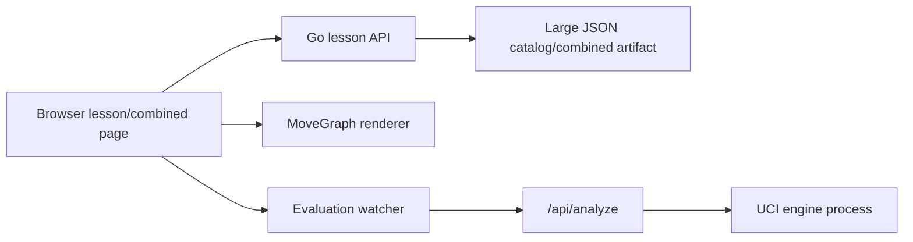

# Tối Ưu Tốc Độ Dự Án

## Bối Cảnh

Dự án hiện là ứng dụng học Cờ Tướng gồm frontend Vue 3/Vite và backend Go `net/http`. Luồng dữ liệu chính đọc catalog JSON lớn từ `apps/api/data/lessons/lessons.json`, phục vụ danh sách lesson, lesson detail, trang tổng hợp `/combined`, và phân tích vị trí qua engine UCI.

Docs hiện có gồm `docs/features/lesson-experience.md` và kế hoạch `docs/specs/planning/combined-lesson-page.md`. `docs/_sync.md` ghi trạng thái synced với `HEAD` nhưng không có hash cụ thể, nên docs được dùng làm bối cảnh gần hiện tại và đã được đối chiếu lại bằng code/config/dữ liệu.

Baseline được đo trên máy local ngày 2026-05-29, không chạy production web build mới trong bước lập kế hoạch. Các số đo frontend bundle chỉ tham khảo từ `apps/web/dist` hiện có.

## Baseline Hiện Tại

### Dữ Liệu Và Payload

- `apps/api/data/lessons/lessons.json`: 20.919.861 bytes, 6.261 lesson, 6.281 line, 35.183 move.
- `apps/api/data/lessons/combined-lesson.json`: 16.420.828 bytes, 831 line, 35.183 move, max 237 move/line.
- Có lệch giữa artifact và script build hiện tại: `scripts/build_combined_lesson.py --dry-run` báo nếu rebuild từ catalog hiện tại sẽ tạo 6.281 combined line, không phải 831 line. Vì vậy các số đo `/combined` bên dưới là baseline của artifact đang được app phục vụ hiện tại, chưa chắc là baseline sau khi regenerate.
- Nếu rebuild theo script hiện tại, combined overview ước tính tăng lên khoảng 1.334.903 bytes, với 564 opening line, 2.872 middlegame line, 2.845 endgame line; số unique FEN của middlegame/endgame lần lượt khoảng 2.816/2.818. Đây là rủi ro render lớn vì `MoveGraph` hiện tạo start node cho từng start group.
- Combined overview ước tính: khoảng 189.715 bytes cho 831 line summary, không gửi full move list.
- Root next-step opening trả khoảng 166.802 bytes, 410 line, 7 nước đầu unique.
- Sau nước đầu phổ biến nhất, next-step trả khoảng 125.426 bytes, 305 line, 3 nước tiếp theo unique.
- Existing `apps/web/dist`: JS khoảng 111KB, CSS khoảng 33KB. Con số này không được xem là build hiện tại tuyệt đối vì chưa rebuild trong bước plan.

### API Runtime Local

Đo bằng API local ở port riêng:

- `GET /api/health`: khoảng 0,5-0,8ms.
- `GET /api/categories`: khoảng 0,5-1,0ms.
- `GET /api/lessons`: khoảng 1,8-2,1ms, payload khoảng 827.815 bytes.
- `GET /api/combined-lesson`: cold khoảng 95ms do lazy load/parse `combined-lesson.json`; hot khoảng 1,2-1,5ms.
- `POST /api/combined-lesson/next-steps` tại root opening: hot khoảng 1-4ms sau khi combined artifact đã nạp.
- `POST /api/analyze` với Pikafish thật: khoảng 2,15-2,17s/request theo mặc định hiện tại.

### Dev Loop

- `python3 scripts/build_combined_lesson.py --dry-run`: khoảng 0,54s.
- `go test ./apps/api/...` cached: khoảng 0,21s.
- `go test -count=1 ./apps/api/...`: khoảng 5,23s, trong đó các package test liên quan dữ liệu lớn mất 2,3-4,7s.

### Graph Frontend

Mô phỏng chi phí dựng dữ liệu graph từ combined artifact:

- Opening root lazy-loaded: khoảng 52 node, 7 link, dưới 1ms để dựng cấu trúc dữ liệu.
- Một nhánh depth 2: khoảng 55 node, 10 link, dưới 1ms.
- Nếu cả opening phase được load hết: khoảng 16.593 node, 16.548 link, khoảng 32ms chỉ để dựng dữ liệu/layout trong Node, chưa tính tạo SVG DOM trong browser.

## Nguyên Nhân Và Lý Do Thiết Kế

Triệu chứng chậm đáng tin cậy nhất hiện tại không nằm ở API lesson hot path. Các endpoint dữ liệu sau khi đã nạp file đều nhanh trên local. Rủi ro hiệu năng chính nằm ở ba nhóm:

- Engine analysis có latency mặc định khoảng 2 giây vì mỗi request khởi động một process UCI mới và chạy `go movetime 2000`.
- Move graph đang trộn topology graph với active state, nên điều hướng từng nước có thể làm computed `graphData` đổi và watcher render lại toàn bộ SVG.
- Dataset JSON lớn làm cold-load, initial payload, test uncached và khả năng scale về sau dễ chậm nếu corpus tiếp tục tăng.

Nguyên nhân trực tiếp:

- `apps/api/internal/analysis/uci.go` tạo `exec.CommandContext` mới cho mỗi request và khởi tạo UCI lại từ đầu.
- `apps/api/internal/analysis/config.go` đặt `defaultEngineTimeMS = 2000`.
- `apps/web/src/composables/useMoveEvaluation.ts` tự gọi `/api/analyze` sau debounce 180ms khi còn pending move.
- `apps/web/src/components/MoveGraph.vue` tính `graphPaths`, `graphData`, node label, boardBefore và active state trong cùng computed.
- `MoveGraph.vue` watch `graphData` rồi `destroyGraph()` và `renderTreeGraph()` lại toàn bộ.
- `apps/api/internal/httpapi/server.go` lazy load `combined-lesson.json` 16MB ở request `/api/combined-lesson` đầu tiên.
- `combinedNextStepWindow` scan toàn bộ line và so prefix theo request; hiện nhanh với 831 line nhưng là O(line * prefix).
- Combined artifact đang không khớp với output của script build hiện tại, nên mọi tối ưu `/combined` phải quyết định trước artifact 831 line là chủ đích hay là dữ liệu stale.

Nguyên nhân gốc rễ:

- Hệ thống đã chuyển từ lesson nhỏ sang corpus lớn nhưng một số contract vẫn coi graph, engine và dữ liệu như một lesson tương tác nhỏ.
- Engine analysis được thiết kế như một thao tác stateless đơn giản, phù hợp để đúng trước, nhưng chưa phù hợp với UI tự động phân tích liên tục.
- Graph renderer hiện rebuild theo "state của selection" thay vì chỉ rebuild khi topology thay đổi.

## Góc Nhìn Tổng Quan Và Phạm Vi Tập Trung

Phạm vi tối ưu nên tập trung vào tốc độ cảm nhận của người dùng trên hai màn hình chính:

- Trang lesson thường: tải catalog, mở lesson, điều hướng nước, phân tích engine.
- Trang `/combined`: tải overview, hydrate next-step, điều hướng graph, preview nước tiếp theo.

Ngoài phạm vi cho lượt tối ưu đầu:

- Không đổi schema lesson public nếu chưa cần.
- Không thay engine Pikafish hoặc thay thuật toán đánh giá cờ.
- Không thiết kế lại toàn bộ UI graph.
- Không nhập thêm dữ liệu lesson mới.
- Không tối ưu parser/extractor ngoài phần ảnh hưởng trực tiếp đến dev loop.

## Luồng Hiệu Năng Chính

Các điểm ưu tiên là `E -> F -> G` cho latency tương tác, `A -> D` cho render/jank, và `B -> C` cho cold-load/payload.

## Hướng Tiếp Cận Đề Xuất

### 1. Khóa Lại Contract Của Combined Artifact

Trước khi tối ưu `/combined`, cần quyết định trạng thái đúng của `combined-lesson.json`:

- Nếu 831 line là chủ đích, script build phải được sửa hoặc tài liệu hóa để tái tạo đúng artifact hiện tại.
- Nếu 6.281 line là trạng thái đúng sau rebuild, cần đo lại baseline `/combined` với artifact mới trước khi tối ưu graph/backend.
- Thêm kiểm tra để script dry-run và artifact checked-in không lệch âm thầm.

Tiêu chí: sau bước này, `scripts/build_combined_lesson.py --dry-run` và artifact runtime có cùng mô hình line dự kiến, hoặc có tài liệu rõ vì sao chúng khác nhau.

### 2. Tạo Baseline Đo Lặp Lại Được

Trước khi sửa hiệu năng, thêm hoặc chuẩn hóa một bộ đo nhỏ để tránh tối ưu theo cảm giác:

- API benchmark local cho `/api/lessons`, `/api/combined-lesson`, `/api/combined-lesson/next-steps`, `/api/analyze`.
- Frontend graph benchmark chạy bằng Node hoặc Vitest cho các case: root lazy, branch depth 2, full phase loaded.
- Browser check cho `/combined` bằng Playwright hoặc Lighthouse sau khi được phép chạy build/dev server.
- Ghi lại payload size và số node/link graph trong output benchmark.

Tiêu chí: benchmark phải chạy độc lập, không cần engine nếu chỉ đo data endpoint, và có mode bật engine riêng khi `ENGINE_PATH` tồn tại.

### 3. Tối Ưu Engine Analysis Trước

Đây là điểm chậm rõ nhất: khoảng 2,15s/request hiện tại với engine thật.

Hướng triển khai:

- Tách UCI analyzer thành service sống lâu hơn thay vì spawn process cho từng request.
- Giữ một worker engine persistent tối thiểu cho dev/local; nếu cần scale sau này, thêm pool nhỏ có giới hạn concurrency.
- Thêm cache theo key gồm `fen`, `sideToMove`, `nextMove`, `depth` hoặc `timeMS`.
- Giảm default UI analysis xuống mức nhanh hơn, ví dụ 300-500ms, và để phân tích sâu là lựa chọn riêng.
- Frontend chỉ tự phân tích khi vị trí ổn định, tránh request khi user đang tua nhanh. Có thể giữ debounce nhưng thêm trạng thái "latest request wins" và không hiển thị response stale.
- Nếu backend đang bận, trả trạng thái rõ ràng hoặc queue có giới hạn thay vì spawn thêm process.

Ràng buộc:

- Persistent engine cần lifecycle sạch khi server shutdown.
- Cache phải có giới hạn dung lượng hoặc TTL để không giữ vô hạn các FEN.
- Nếu request bị hủy, worker không được rơi vào state UCI hỏng; cần protocol reset/stop rõ ràng.

### 4. Tách Topology Graph Khỏi Active State

Mục tiêu là điều hướng active node không render lại toàn bộ SVG.

Hướng triển khai:

- Chia `MoveGraph.vue` thành hai lớp dữ liệu:
  - Topology: start group, trie node, label ổn định, lineIds, moveIndex.
  - View state: active node, past path, selected node.
- `renderTreeGraph` chỉ chạy lại khi topology đổi, ví dụ khi hydrate thêm move window hoặc đổi phase.
- Khi chỉ đổi active node, dùng renderer method để update class/color/path selection thay vì `destroyGraph()` + tạo SVG mới.
- Memoize boardBefore/notation theo line id + move index để không replay lại toàn bộ loaded path trong mỗi computed.
- Tránh để `graphData` phụ thuộc trực tiếp vào `activeMoveIndex` nếu chỉ cần cập nhật state hiển thị.
- Giữ lazy loading hiện tại vì nó đang giúp graph ban đầu nhỏ; không chuyển sang full-load phase nếu chưa có virtualization.

Tiêu chí:

- Bấm previous/next trên graph đã load không tạo lại toàn bộ SVG.
- Full phase loaded vẫn không làm navigation vượt một frame 16ms trên máy dev mục tiêu.
- Topology render có thể chậm hơn selection update, nhưng chỉ xảy ra khi dữ liệu graph thật sự mở rộng.

### 5. Index Combined Lesson Trên Backend

Endpoint next-step hiện nhanh, nhưng cách scan toàn bộ line theo prefix sẽ tăng chi phí khi corpus lớn hơn.

Hướng triển khai:

- Khi `loadCombinedLesson()` nạp artifact, dựng thêm index in-memory:
  - `phase`
  - normalized `initialFen`
  - prefix signature hoặc trie node id
  - danh sách line tương ứng và next move window metadata
- Cache sẵn `phase`, `pieceCount`, `moveCount`, `effectiveInitialFen`, `maxMoveCount` cho từng line.
- `combinedOverview()` dùng metadata đã tính sẵn thay vì tính FEN piece count mỗi request.
- `combinedNextStepWindow()` tìm node từ index rồi slice move window, không scan toàn bộ line nếu có thể.
- Cân nhắc sinh riêng `combined-lesson-overview.json` nhỏ trong script build để request cold `/api/combined-lesson` không cần parse file 16MB.

Tiêu chí:

- Cold `/api/combined-lesson` giảm từ khoảng 95ms xuống dưới 30ms nếu dùng overview artifact.
- Hot next-step giữ dưới 5ms với dataset hiện tại.
- Không đổi response shape hiện có của frontend.

### 6. Giảm Payload Và Cache API Catalog

`/api/lessons` hiện trả summary nhưng payload vẫn khoảng 828KB vì có 6.261 item.

Hướng triển khai:

- Cache summaries và categories trong `Repository` lúc load thay vì tạo lại slice mỗi request.
- Thêm `ETag` hoặc `Last-Modified` cho catalog/combined overview để browser có thể nhận `304`.
- Thêm gzip/br compression nếu app tự serve trực tiếp, hoặc ghi rõ cần reverse proxy nén ở deploy.
- Nếu catalog tiếp tục tăng, thêm phân trang hoặc lazy category expand endpoint: `/api/categories` trước, `/api/lessons?category=...` sau.

Tiêu chí:

- Request lặp lại tới `/api/lessons` trả `304` khi dữ liệu không đổi.
- Payload nén của catalog giảm đáng kể trên network thật.
- UI catalog vẫn mở bài đầu mặc định mà không cần tải full detail của mọi lesson.

### 7. Làm Nhẹ Dev/Test Loop

Uncached `go test -count=1 ./apps/api/...` khoảng 5,23s. Đây chưa phải vấn đề lớn, nhưng sẽ gây chậm nếu thêm nhiều test đọc full JSON.

Hướng triển khai:

- Chuyển các test contract nhỏ sang fixture mini.
- Giữ một nhóm integration test duy nhất đọc full `lessons.json`.
- Nếu cần kiểm tra full catalog nhiều invariant, gom vào một test pass để tránh parse JSON lặp.
- Thêm benchmark hoặc test helper cache dữ liệu trong package khi không làm sai isolation.

Tiêu chí:

- Uncached API test về dưới khoảng 3s trên máy hiện tại.
- Vẫn giữ coverage full catalog cho UUID/schema/replay contract quan trọng.

## Công Việc Cần Làm

1. Quyết định và khóa lại contract của combined artifact 831 line hay 6.281 line.
2. Thêm benchmark/performance scripts tối thiểu và lưu baseline hiện tại.
3. Tối ưu engine analysis bằng persistent worker hoặc cache + default time ngắn hơn cho UI.
4. Refactor `MoveGraph` để topology change và active selection update là hai đường riêng.
5. Thêm combined lesson metadata/index ở backend, giữ nguyên API response.
6. Thêm cache/ETag/nén cho catalog và combined overview.
7. Tối ưu test fixtures nếu dev loop bắt đầu cản trở.
8. Chạy lại benchmark sau từng nhóm thay đổi và so với baseline.

## Rủi Ro Và Ràng Buộc

- Persistent UCI engine có rủi ro stateful protocol: cần xử lý `stop`, `ucinewgame`, timeout và process restart cẩn thận.
- Cache engine có thể trả kết quả stale nếu key thiếu `timeMS`, `depth`, `sideToMove` hoặc `nextMove`.
- Refactor graph dễ làm sai selection/active path nếu topology node id không ổn định.
- Backend index combined làm tăng memory, nhưng dataset hiện tại nhỏ đủ để chấp nhận.
- Nếu combined artifact được regenerate thành 6.281 line, tab middlegame/endgame có hàng nghìn start group FEN riêng và có thể chậm dù chưa hydrate move nào.
- Gzip/ETag cần thống nhất với môi trường deploy; nếu sau này đặt sau reverse proxy thì không nên nén trùng.
- Không nên full-load toàn bộ combined moves lên frontend chỉ để graph nhanh hơn ở một thao tác; rủi ro DOM/memory lớn hơn lợi ích.

## Kiểm Chứng

Sau khi triển khai từng bước, kiểm chứng bằng:

- `go test -count=1 ./apps/api/...`
- `npm run build:web` khi bước triển khai frontend được duyệt.
- Benchmark API:
  - `/api/lessons`
  - `/api/combined-lesson`
  - `/api/combined-lesson/next-steps`
  - `/api/analyze` có và không có engine.
- Benchmark graph:
  - root lazy-loaded
  - branch depth 2
  - full phase loaded hoặc synthetic large graph.
- Browser smoke test:
  - mở lesson thường
  - mở `/combined`
  - bấm next/previous nhanh
  - chọn preview move
  - đổi phase
  - bật engine analysis và xác nhận không có response stale.

## Tiêu Chí Chấp Nhận

- Engine quick analysis cho UI không còn mặc định mất khoảng 2 giây nếu chỉ cần feedback tương tác nhanh.
- Điều hướng graph không rebuild SVG toàn bộ khi topology không đổi.
- `/combined` cold start giảm rõ hoặc ít nhất có số đo chứng minh cold parse không còn là nghẽn ưu tiên.
- Catalog có caching/nén để giảm chi phí payload lớn trên network thật.
- Benchmark mới chứng minh các thay đổi nhanh hơn baseline và không làm lệch contract hiện có.
