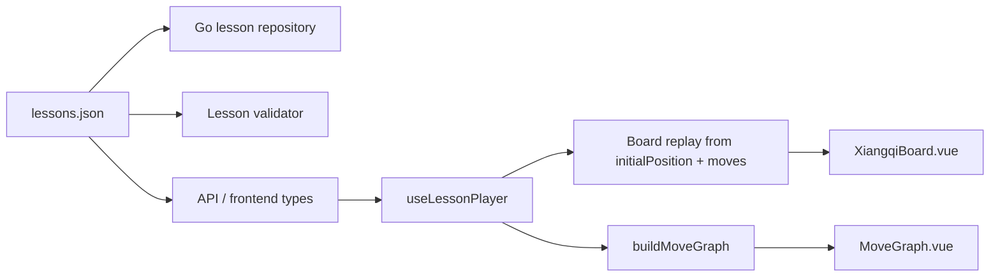

# Sửa Data Nước Đi Và Cây Biến Hóa

## Bối Cảnh

Ứng dụng đang học cờ tướng bằng các bài lesson trong `apps/api/data/lessons/lessons.json`. Frontend replay bàn cờ từ `initialBoard` qua `replayMoves`, rồi dùng `MoveGraph` để hiển thị các biến chính/phụ. Theo docs hiện có, graph yêu cầu các nước chung trước điểm rẽ nhánh dùng cùng `move.id`, còn các nước sau điểm rẽ nhánh có id riêng để choice và node branch trỏ đúng biến.

Docs đang ở trạng thái `partially-synced` và repo chưa có `HEAD` hợp lệ, nên kế hoạch này dựa trên code hiện tại, dữ liệu hiện tại và đối chiếu thêm với tài liệu cờ tướng bên ngoài.

Nguồn tham khảo chính:

- Xiangqi.com mô tả bàn cờ 9x10, quân nằm trên giao điểm, setup khai cuộc, Đỏ đi trước, pháo ở hàng thứ ba từ đáy và binh ở các giao điểm cách một lộ.
- Xiangqi.com mô tả luật quân: xe đi thẳng như rook, mã bị chặn chân, pháo đi thẳng nhưng khi ăn phải nhảy đúng một ngòi, binh trước khi qua sông chỉ tiến.
- XQ in English ghi rõ hệ lộ của Đỏ và Đen ngược nhau: lộ 1 của Đỏ là lộ 9 của Đen, lộ 2 của Đỏ là lộ 8 của Đen, trừ trung lộ 5.
- Xiangqi.com glossary và ECCO có các line khai cuộc chuẩn để đối chiếu, ví dụ Nghịch Pháo `1. C2=5 C2=5`, Thuận Pháo `1. C2=5 C8=5`, và Central Cannon gặp Screen Horse `1. C2=5 H8+7`.

## Triệu Chứng

Data hiện tại “replay được” ở mức `applyMove` đơn giản nhưng sai rất nhiều nếu kiểm theo luật cơ bản:

- Một số nước tự ăn quân mình, ví dụ `Xe 1 bình 2` từ `(0,9)` sang `(1,9)` trong khi mã đỏ vẫn đứng ở `(1,9)`.
- Một số nước pháo đi qua quân khi không ăn, hoặc ăn quân nhưng không có đúng một ngòi.
- Một số nước mã bị chặn chân.
- Một số nước sĩ/tượng đi vào ô đang có quân cùng phe.
- Nhiều bài trung cuộc/tàn cuộc đang replay từ bàn cờ khai cuộc, trong khi nội dung mô tả là thế đã vào giữa/tàn cuộc. Vì vậy dữ liệu phải bẻ nước cho khớp bài học, dẫn đến sai luật và sai thế.

Kiểm tra nhanh hiện tại phát hiện ít nhất 31 nước sai luật cơ bản trên 20 lesson. Con số này chưa tính lỗi chiến thuật hoặc sai lựa chọn khai cuộc theo lý thuyết.

## Nguyên Nhân Và Lý Do Thiết Kế

Nguyên nhân trực tiếp là lesson data đang trộn ba lớp khác nhau vào cùng một mảng move:

- Ký pháp người đọc thấy, ví dụ `Pháo 2 bình 5`.
- Tọa độ tuyệt đối của app, ví dụ `{ file: 1, rank: 7 } -> { file: 4, rank: 7 }`.
- Ngữ cảnh thế cờ, hiện bị mặc định là `initialBoard` cho mọi bài.

Nguyên nhân gốc rễ là chưa có data contract đủ chặt cho lesson:

- Không có `initialPosition`/FEN riêng cho bài trung cuộc, thế sát và tàn cuộc.
- Không có validator bắt buộc để đối chiếu ký pháp, tọa độ, quân tại nguồn, luật di chuyển và choice/graph.
- `MoveGraph` hiện suy graph từ mảng line bằng shared prefix. Cách này dùng được cho hai biến đơn giản, nhưng không đại diện được một graph thật khi nhiều line hội tụ, có cùng nước ở nhánh khác, hoặc cần thêm node/edge rõ ràng.

Động lực thiết kế là tách rõ “nội dung bài học” khỏi “trạng thái bàn cờ replay” và biến graph thành projection có kiểm chứng từ data. Sau thay đổi, data sai sẽ fail test thay vì âm thầm render sai.

## Góc Nhìn Tổng Quan Và Phạm Vi Tập Trung

Phạm vi tập trung:

- Sửa contract data để mỗi lesson có thể khai báo thế xuất phát riêng.
- Sửa toàn bộ dữ liệu nước đi đang sai luật cơ bản.
- Tham khảo các line khai cuộc chuẩn trên mạng cho nhóm khai cuộc, ít nhất với Central Cannon, Screen Horse, Same Direction Cannons và Opposite Direction Cannons.
- Với trung cuộc, thế sát và tàn cuộc, chuyển sang thế xuất phát minh bạch thay vì giả vờ bắt đầu từ khai cuộc.
- Thêm validator dùng chung cho backend test hoặc script để kiểm tra mọi lesson.
- Sửa `MoveGraph` để dùng graph model node/edge ổn định, không phụ thuộc hoàn toàn vào shared prefix.

Ngoài phạm vi:

- Không viết engine cờ tướng hoàn chỉnh để đánh giá thắng thua sâu.
- Không tự động sinh biến khai cuộc dài từ engine hoặc database ván đấu.
- Không thêm nước đi tự do cho người học ngoài move/choice đã khai báo.
- Không thay đổi UI lớn ngoài phần graph cần dùng dữ liệu đúng.

## Mục Tiêu

- Mọi move trong `lessons.json` hợp lệ trên board state trước đó theo luật di chuyển cơ bản.
- Ký pháp và tọa độ thống nhất theo hệ lộ Đỏ/Đen.
- Các lesson không phải khai cuộc có `initialPosition` rõ ràng hoặc một cơ chế tương đương.
- Choice option luôn trỏ đến một move tồn tại và nằm đúng điểm rẽ nhánh.
- Graph hiển thị node/edge thật theo biến hóa, giữ được shared trunk, branch và active state đúng.
- Có validation tự động để tránh data sai quay lại.

## Logic Nghiệp Vụ

### Hệ Tọa Độ Và Ký Pháp

App tiếp tục dùng tọa độ tuyệt đối:

- `file = 0..8` từ trái sang phải theo góc nhìn hiện tại của board.
- `rank = 0..9` từ phía Đen xuống phía Đỏ.
- Đỏ bắt đầu ở rank 9, Đen bắt đầu ở rank 0.

Ký pháp truyền thống cần dịch theo bên đi:

- Với Đỏ: lộ 1..9 tương ứng `file 0..8`.
- Với Đen: lộ 1..9 tương ứng `file 8..0`.
- `bình` thay đổi file cùng rank.
- `tiến` của Đỏ giảm rank, `tiến` của Đen tăng rank.
- `thoái` ngược lại.

### Thế Xuất Phát

Lesson nên có:

```ts
interface Lesson {
  initialPosition?: LessonPosition
  lines: LessonLine[]
}
```

Giai đoạn đầu có thể dùng một trong hai hướng:

- `initialFen`: dùng FEN/X-FEN nếu muốn gọn và dễ đối chiếu với engine.
- `initialPieces`: danh sách quân theo cùng shape với `initialBoard` nếu muốn dễ đọc trong JSON.

Đề xuất dùng `initialFen` vì repo đã có `apps/web/src/engine/fen.ts` và có plan tích hợp evaluation. Nếu parser FEN hiện chưa đủ cho board render, bổ sung helper chuyển FEN sang `BoardState`.

### Graph Data

Graph không nên chỉ suy từ `sharedPrefixLength`. Cần một graph chuẩn hóa từ lines:

```ts
interface MoveGraphNode {
  key: string
  move: LessonMove
  lineIds: string[]
  ply: number
}

interface MoveGraphEdge {
  from: string | null
  to: string
  lineIds: string[]
}
```

Node key nên dựa trên `(ply, side, from, to, id)` hoặc một `graphKey` explicit khi cần gom node giống nhau giữa nhiều line. `move.id` vẫn giữ vai trò stable id cho choice và navigation, nhưng graph cần biết khi nào hai move là cùng node và khi nào chỉ là hai move cùng ký pháp ở ngữ cảnh khác.

## Cấu Trúc Giải Pháp



## Hướng Tiếp Cận Đề Xuất

1. Đặt contract trước khi sửa data hàng loạt.
2. Thêm validator để nhìn toàn bộ lỗi thay vì sửa thủ công theo cảm giác.
3. Sửa dữ liệu theo từng nhóm lesson:
   - Khai cuộc: bám các line chuẩn tham khảo từ Xiangqi.com/ECCO.
   - Trung cuộc/thế sát/tàn cuộc: khai báo thế xuất phát đúng, rồi viết line ngắn 2-6 ply từ thế đó.
4. Sửa graph model để đọc cùng data đã validate.
5. Chạy test backend và build frontend sau khi data/code ổn.

## Chi Tiết Triển Khai

### 1. Thêm Contract Position

- Cập nhật Go type `Lesson` trong `apps/api/internal/lessons/types.go`.
- Cập nhật frontend type `Lesson` trong `apps/web/src/api/types.ts`.
- Thêm helper lấy board xuất phát trong `useLessonPlayer`: nếu lesson có `initialFen` thì parse, nếu không dùng `initialBoard`.
- Nếu parser FEN hiện phục vụ evaluation nhưng chưa đủ cho render, thêm hàm riêng trong `apps/web/src/engine/fen.ts` hoặc `apps/web/src/core/xiangqi.ts`.

### 2. Thêm Validator

Validator cần kiểm:

- Lesson có ít nhất một line.
- Mỗi line replay được từ `initialPosition`.
- Source square có quân đúng `side`.
- Target square không có quân cùng phe.
- Luật cơ bản của xe, pháo, mã, tượng, sĩ, tướng, binh.
- Pháo khi ăn có đúng một ngòi, khi không ăn không có quân chắn.
- Mã không bị chặn chân.
- Tượng không qua sông và không bị chặn mắt.
- Sĩ/tướng ở trong cung.
- Hai tướng không nhìn thẳng nhau sau move.
- Choice option trỏ đến move tồn tại.
- Shared graph nodes và branch nodes không mâu thuẫn.

Nơi đặt validator:

- Backend: thêm test trong `apps/api/internal/lessons/repository_test.go` để chạy cùng `go test`.
- Frontend: nếu cần tái dùng logic replay TypeScript, thêm script riêng sau. Trước mắt ưu tiên Go test vì data được backend load đầu tiên.

### 3. Sửa Data Khai Cuộc

Các bài khai cuộc cần đổi sang line có thật:

- Central Cannon vs Screen Horse:
  - `1. C2=5 H8+7`
  - Có thể tiếp `2. H2+3 H2+3` hoặc các biến phát triển xe theo nguồn.
- Thuận Pháo:
  - `1. C2=5 C8=5`
  - `2. H2+3 H8+7`
  - `3. R1=2` sau khi file xe đã được mở hợp lệ hoặc chọn line có nước mở mã trước.
- Nghịch Pháo:
  - `1. C2=5 C2=5`
  - `2. H2+3 H8+7` hoặc `H8+9` theo biến.

Khi notation nói `Xe 1 bình 2`, dữ liệu phải đảm bảo quân ở lộ 2 đã rời khỏi ô xuất phát hoặc chọn notation khác hợp lệ như `Xe 1 tiến 1` nếu muốn xuất xe sớm.

### 4. Sửa Data Trung Cuộc, Thế Sát, Tàn Cuộc

Không nên ép các bài này replay từ setup khai cuộc. Mỗi bài cần một `initialFen` riêng mô tả đúng mô-típ:

- Trung cuộc: các quân chính đã phát triển, lộ trung/cánh đã mở theo nội dung bài.
- Thế sát: bố trí ngòi pháo, cung tướng, sĩ/tượng và quân tấn công đúng motif.
- Tàn cuộc: chỉ giữ quân còn liên quan như xe, binh, sĩ/tượng/tướng, tránh để quân khai cuộc chắn sai luật.

Sau đó mỗi line chỉ cần ngắn, rõ:

- 1-2 ply tạo tình huống.
- 1 choice ply.
- 1-2 ply minh họa hệ quả.

### 5. Sửa MoveGraph

- Tách hàm `buildMoveGraph(lines)` ra khỏi component hoặc đặt trong component nhưng có unit logic rõ.
- Graph nodes được tạo từ normalized path thay vì chỉ `sharedPrefixLength`.
- Edge nối theo từng line path, có thể gom edge nếu nhiều line dùng cùng node.
- Active state dựa trên active path của line hiện tại và `activeMoveIndex`.
- Khi click shared node, giữ line đang active nếu line đó chứa node; nếu không chọn line đầu tiên chứa node.
- Khi click branch node, chọn đúng line và ply của node đó.

### 6. Cập Nhật Docs Sau Khi Sửa

Sau khi execution xong, cần cập nhật docs/spec liên quan:

- `docs/specs/planning/floating-lesson-steps.md` hoặc tạo spec implemented mới nếu graph contract thay đổi đáng kể.
- `docs/_sync.md` cập nhật scope/trạng thái nếu repo vẫn unborn HEAD.

## Công Việc Cần Làm

1. Thêm type `initialFen`/`initialPosition` cho lesson ở backend và frontend.
2. Thêm parser/helper để board replay dùng position của lesson.
3. Viết validator/test cho legal replay, choice và graph contract.
4. Sửa toàn bộ 20 lesson theo nhóm, ưu tiên dữ liệu hợp lệ và đúng motif hơn giữ nguyên text cũ.
5. Sửa `MoveGraph` sang graph model node/edge.
6. Chạy `go test ./apps/api/...`.
7. Chạy `npm --prefix apps/web run build`.
8. Nếu UI graph bị ảnh hưởng, mở dev server và kiểm tra bằng browser screenshot.

## Rủi Ro Và Ràng Buộc

- Nguồn online có nhiều hệ ký pháp; phải nhất quán với mapping tọa độ của app thay vì copy máy móc.
- Một số nội dung hiện tại có thể là mô-típ tự viết, không phải line khai cuộc chuẩn. Với các bài đó, nên giữ ý tưởng nhưng tạo `initialFen` đúng.
- Nếu thêm FEN, cần đảm bảo evaluation và board render hiểu cùng orientation.
- Graph mới có thể làm thay đổi layout; cần giữ kích thước node ổn định và tránh layout shift.
- Dữ liệu sửa nhiều, nên validator là điều kiện bắt buộc trước khi review bằng mắt.

## Kiểm Chứng

- `go test ./apps/api/...` pass, trong đó validator không còn lỗi replay.
- `npm --prefix apps/web run build` pass.
- Không còn lỗi source empty, own capture, cannon screen mismatch, horse leg blocked, palace/river violation trong toàn bộ lesson.
- Choice prompt hiện ở đúng ply trước branch.
- Bấm choice option chuyển đến line và node graph đúng.
- Bấm node shared giữ ngữ cảnh line hợp lý.
- Bấm node branch chuyển board, counter, current move và evaluation về đúng ply.
- Kiểm tra thủ công ít nhất một bài khai cuộc, một bài trung cuộc, một thế sát và một tàn cuộc.
