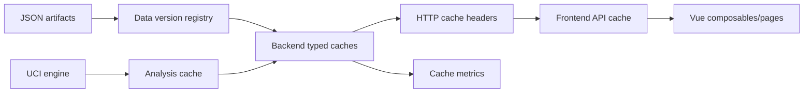

# Chiến Lược Cache Thông Minh

## Bối Cảnh

Dự án hiện có backend Go `net/http`, frontend Vue/Vite và dữ liệu lesson lớn đọc từ JSON. Luồng chính gồm catalog lesson, lesson detail, trang `/combined`, lazy next-step cho move graph và phân tích engine UCI. Theo docs hiện tại, hệ thống đã có một số cache cục bộ: repository cache summary/category khi load, combined lesson cache trong memory, graph state update không rebuild topology, và cache kết quả phân tích engine gần đây.

Baseline gần nhất từ `scripts/perf/baseline.mjs` ngày 2026-05-30:

- `lessons.json`: 20.919.861 bytes, 6.261 lesson, 6.281 line, 35.183 move.
- `combined-lesson.json`: 16.420.828 bytes, 831 line, 35.183 move.
- Combined overview khoảng 189.715 bytes.
- Root opening next-step khoảng 166.801 bytes, 410 line.
- Branch next-step phổ biến khoảng 125.425 bytes, 305 line.
- Full opening graph loaded có thể lên 16.593 node và 16.548 link.

Các cache hiện có giúp giảm tính toán lặp trong process nhưng chưa tạo thành một chiến lược cache thống nhất. Chưa có contract rõ cho cache key, data version, TTL, invalidation, HTTP conditional cache, request coalescing, stale-while-revalidate, client-side reuse hoặc quan sát cache hit/miss.

## Nguyên Nhân Và Lý Do Thiết Kế

Triệu chứng cần xử lý không chỉ là một endpoint chậm đơn lẻ. Dữ liệu chính tương đối tĩnh, nhiều request có tính lặp cao, nhưng mỗi lớp đang tự xử lý theo cách riêng:

- Backend có cache in-memory nhưng chưa có data version chung để invalidation an toàn.
- Frontend gọi lại catalog, lesson detail, combined overview và next-step theo lifecycle component, chưa có cache client dùng lại giữa route, phase hoặc back/forward.
- HTTP response chưa dùng `ETag`, `Last-Modified` hoặc `304`, nên browser/proxy không tham gia giảm network.
- Engine analysis có cache kết quả nhưng chưa có TTL rõ, chưa có coalescing cho nhiều request cùng key đang chạy, và chưa có telemetry hit/miss.
- Combined next-step vẫn scan line theo request; nếu user qua lại node cũ, client/backend có thể tính và gửi lại cùng cửa sổ dữ liệu.

Nguyên nhân gốc rễ là hệ thống chưa có mô hình "dữ liệu tĩnh theo phiên bản" và "dữ liệu động theo thời gian sống" tách biệt. Vì vậy cache đang là tối ưu cục bộ thay vì một contract xuyên suốt giữa artifact dữ liệu, API, frontend và engine.

Hướng thiết kế nên coi cache là một phần của contract dữ liệu:

- Dữ liệu lesson/combined là immutable theo `dataVersion`.
- Kết quả engine là derived data theo `engineVersion + request settings`.
- Cache client chỉ được dùng khi có key và invalidation rõ.
- Cache backend phải có giới hạn dung lượng, TTL hoặc data-version boundary.
- Response cache phải quan sát được để tránh "nhanh nhưng sai".

## Góc Nhìn Tổng Quan Và Phạm Vi Tập Trung

Phạm vi tập trung:

- Cache policy chung cho backend và frontend.
- Version/hash cho dữ liệu lesson và combined artifact.
- HTTP conditional cache cho endpoint đọc dữ liệu.
- Cache key chuẩn cho combined next-step và engine analysis.
- Request coalescing để tránh nhiều request đồng thời cùng key.
- Client-side cache cho catalog, lesson detail, combined overview, combined next-step và analysis result.
- Telemetry cơ bản để đo cache hit/miss/eviction.

Ngoài phạm vi:

- Không đưa Redis hoặc cache phân tán vào lượt đầu nếu app vẫn chạy một process backend.
- Không thay schema public lesson nếu ETag/header đủ giải quyết.
- Không thay engine UCI hoặc thuật toán phân tích.
- Không full-load toàn bộ combined corpus lên frontend.
- Không biến cache thành nguồn sự thật; JSON artifact vẫn là source of truth.

## Mục Tiêu

- Có một `dataVersion` ổn định cho `lessons.json` và `combined-lesson.json`.
- Các endpoint đọc dữ liệu trả conditional headers để browser/proxy có thể dùng `304`.
- Backend không encode/tính lại response JSON lớn khi dữ liệu chưa đổi.
- Frontend không gọi lại dữ liệu ổn định khi cache local còn hợp lệ.
- Combined next-step và analysis có cache key rõ, có giới hạn, và tránh duplicate in-flight request.
- Có cách đo cache hit/miss để biết cache có thật sự giúp hệ thống nhanh hơn.

## Trạng Thái Triển Khai 2026-05-30

Đã triển khai lượt đầu theo phạm vi cache trong process:

- Backend có `apps/api/internal/cacheutil` để tính `DataVersion` bằng SHA-256 nội dung file, tạo `ETag`, cache response bytes có giới hạn, và coalesce request cùng key.
- Repository lesson giữ `DataVersion`, pre-encode categories, cache JSON bytes cho list theo filter và lesson detail theo id.
- Các endpoint `GET` ổn định trả `ETag`, `Last-Modified`, `X-Data-Version`, `X-Cache`, `Cache-Control: public, max-age=0, must-revalidate`, và trả `304` khi `If-None-Match` khớp.
- Combined cache giữ overview bytes, bounded cache cho move windows/next-step, và coalescing để request cùng key chỉ build một lần.
- Analysis cache có TTL 10 phút, giới hạn 256 entry, phân biệt engine config/search settings/request, coalesces request đồng thời cùng key, và trả `X-Cache` qua HTTP.
- Frontend API client có `apps/web/src/api/cache.ts` với memory cache, optional `sessionStorage`, in-flight dedup, ETag revalidation và `304` handling cho catalog/lesson/combined/next-step/analyze.
- `scripts/perf/baseline.mjs` đã đo thêm `etag`, `x-cache`, `x-data-version`, conditional `304`, và request lặp.

Live check local với `PERF_API_URL=http://127.0.0.1:8099` xác nhận:

- `/api/categories`, `/api/lessons`, `/api/combined-lesson` trả `304` và `bytes: 0` khi gửi lại `If-None-Match`.
- `/api/combined-lesson/next-steps` lặp cùng key chuyển từ `X-Cache: miss` sang `X-Cache: hit`.

Chưa triển khai trong lượt này:

- Dev-only `GET /api/cache/stats`.
- `X-Cache-Key` debug header.
- Stale-while-revalidate chủ động cập nhật state nền; frontend hiện dùng TTL + revalidation khi cache hết hạn.
- Engine binary mtime/size trong key; key hiện chứa path và search config.

## Logic Nghiệp Vụ Và Cache Policy

Cache nên chia thành bốn nhóm:

| Nhóm | Ví dụ | Tính chất | Invalidation |
| --- | --- | --- | --- |
| Artifact tĩnh | `lessons.json`, `combined-lesson.json` | Chỉ đổi khi file đổi | `dataVersion` theo hash hoặc mtime+size |
| Response đọc dữ liệu | categories, lesson summary, lesson detail, combined overview | Derived từ artifact | `dataVersion + path + query` |
| Cửa sổ graph | combined next-step, line move window | Derived từ combined artifact và prefix | `combinedVersion + normalized request key` |
| Engine analysis | `/api/analyze` | Derived từ engine config và request | `engineVersion + fen + sideToMove + nextMove + depth/time` kèm TTL |

Quy tắc cache key:

- Key phải được canonical hóa: trim FEN, normalize phase, sort query params, clamp `from/limit` giống handler thật.
- Key phải chứa version của dữ liệu nguồn.
- Key không được chứa JSON raw khi có thể dùng signature ngắn hơn.
- Request có body lớn như next-step nên hash phần prefix thành `prefixSignature`.
- Engine key phải chứa search settings để không trộn kết quả nhanh và sâu.

Quy tắc TTL:

- Artifact/response đọc dữ liệu có thể sống đến khi `dataVersion` đổi.
- Combined next-step có thể sống theo process hoặc LRU vì artifact immutable trong process.
- Engine analysis nên có TTL hữu hạn hoặc LRU chặt vì có thể phụ thuộc engine binary/config và search budget.
- Frontend cache nên có stale-while-revalidate cho data ổn định, nhưng không hiển thị analysis stale nếu request mới khác key.

## Cấu Trúc Giải Pháp

Thiết kế có ba lớp:

- Data version registry: xác định version và invalidation boundary.
- Backend typed caches: giữ response bytes/objects và in-flight work.
- Frontend API cache: reuse dữ liệu ổn định theo version và route lifecycle.

## Hướng Tiếp Cận Đề Xuất

### 1. Chuẩn Hóa Data Version

Thêm một helper backend tính version cho file dữ liệu:

- `lessonsVersion`: từ SHA-256 của `lessons.json`, hoặc fallback mtime+size khi cần nhanh.
- `combinedVersion`: từ SHA-256 của `combined-lesson.json`.
- `engineVersion`: từ `ENGINE_PATH`, default time/depth config, và nếu rẻ thì mtime+size của binary.

Ứng dụng:

- Repository giữ `DataVersion`.
- Combined cache giữ `DataVersion`.
- Response headers dùng `ETag: "lessons:<hash>"`, `ETag: "combined:<hash>"`.
- Perf baseline in ra version để so sánh dễ hơn.

### 2. Thêm HTTP Conditional Cache

Áp dụng cho các endpoint `GET` ổn định:

- `GET /api/categories`
- `GET /api/lessons`
- `GET /api/lessons/{id}`
- `GET /api/combined-lesson`
- `GET /api/combined-lesson/moves`
- `GET /api/combined-lesson/lines/{id}/moves`

Chi tiết:

- Tạo helper `writeCacheableJSON(w, r, cachePolicy, payloadBytes)`.
- Nếu `If-None-Match` khớp ETag hiện tại thì trả `304` không body.
- Gắn `Cache-Control` theo nhóm:
  - data artifact: `public, max-age=0, must-revalidate`
  - dev có thể giữ `no-cache` semantics để luôn revalidate
- Gắn `Vary` đúng khi có CORS origin hoặc query.
- Không áp dụng HTTP cache cho `POST /api/analyze`; analysis dùng app cache riêng.

### 3. Cache Response Bytes Cho Payload Lớn

Hiện backend cache object nhưng vẫn có thể encode JSON lại. Với payload lớn, nên cache bytes đã encode:

- Repository cache:
  - categories bytes
  - all summaries bytes
  - summaries theo category/query/difficulty nếu query phổ biến
  - lesson detail bytes theo id khi được gọi
- Combined cache:
  - overview bytes
  - line move window bytes theo line/from/limit
  - phase-wide window bytes nếu endpoint còn được dùng

Không cần cache mọi tổ hợp ngay từ đầu. Bắt đầu với response lớn và phổ biến:

- `/api/lessons`
- `/api/combined-lesson`
- root `/api/combined-lesson/next-steps` app-level cache

### 4. Request Coalescing Backend

Thêm singleflight nội bộ cho các request tốn tài nguyên:

- Analysis request cùng cache key.
- Combined next-step cùng key.
- JSON response encode lớn cùng key nếu chưa có bytes cache.

Mục tiêu là nếu 5 request đồng thời tới cùng key, chỉ một request thực hiện tính toán/engine/encode, còn lại chờ kết quả.

Không cần dependency ngoài; có thể tự implement map `key -> inFlightCall` bằng `sync.Mutex` và channel, hoặc dùng `golang.org/x/sync/singleflight` nếu repo chấp nhận thêm dependency.

### 5. Cache Combined Next-Step Theo Trie/Prefix

Combined next-step hiện scan line theo prefix. Cache thông minh nên có hai cấp:

- Index cấp topology: `phase + initialFen + prefixSignature -> []lineID`
- Window cấp response: `topologyKey + from + limit -> combinedStepMoveWindow hoặc JSON bytes`

Trong lượt đầu, dùng app-level LRU cho response window để giảm rủi ro. Nếu hit rate cao và corpus tăng, mới chuyển sang trie index đầy đủ khi load combined artifact.

### 6. Cache Frontend Có Version Và In-Flight Dedup

Thêm một module frontend, ví dụ `apps/web/src/api/cache.ts`:

- In-memory cache map theo `method + url + bodyHash + dataVersion`.
- In-flight map để dedupe request cùng key.
- Optional `sessionStorage` cho catalog/combined overview vì dữ liệu ổn định qua reload.
- TTL theo loại:
  - categories/summaries: dài, revalidate bằng ETag.
  - lesson detail: dài, invalidate theo ETag/dataVersion.
  - combined overview: dài, revalidate bằng ETag.
  - next-step: trong session hoặc giới hạn LRU.
  - analysis: ngắn hơn, chỉ reuse khi key giống tuyệt đối.

Frontend API client cần đọc response headers:

- `ETag`
- `X-Data-Version`
- `X-Cache`

Nếu nhận `304`, client dùng cached body cũ.

### 7. Stale-While-Revalidate Cho UX

Áp dụng ở frontend cho dữ liệu ổn định:

- Catalog hiển thị cached summaries ngay nếu có.
- Gửi request revalidate nền.
- Nếu version đổi, cập nhật state và giữ route active nếu lesson vẫn tồn tại.
- Combined overview hiển thị cached overview ngay, sau đó revalidate.

Không áp dụng stale-while-revalidate cho:

- Analysis khi FEN/current move khác key.
- Next-step đang thiếu move cần cho action hiện tại, vì UI cần đúng branch.

### 8. Observability Và Debug

Thêm headers và endpoint nhẹ:

- `X-Cache: hit | miss | revalidate | bypass`
- `X-Data-Version`
- `X-Cache-Key` chỉ bật khi env debug, tránh lộ key dài mặc định.
- Dev-only `GET /api/cache/stats` trả hit/miss/entries/evictions theo nhóm cache.

Perf script nên đo thêm:

- cold/hot response
- conditional `304`
- cache hit ratio khi gọi lặp endpoint
- analysis first/hit/in-flight duplicate

## Chi Tiết Triển Khai

### Backend

1. Tạo package/helper cache nội bộ, ví dụ `apps/api/internal/cacheutil`.
2. Thêm `DataVersion` vào repository và combined cache.
3. Tạo `cacheableResponse` gồm `etag`, `lastModified`, `dataVersion`, `body`.
4. Thay `writeJSON` ở các endpoint đọc lớn bằng `writeCacheableJSON`.
5. Thêm LRU bounded cache cho:
   - analysis responses
   - combined next-step windows
   - encoded JSON bytes cho response lớn
6. Thêm request coalescing cho analysis và combined next-step.
7. Thêm tests cho:
   - `If-None-Match` trả `304`
   - cache invalidated khi version đổi
   - in-flight request cùng key chỉ tính một lần
   - cache key phân biệt `timeMs/depth/sideToMove/nextMove`

### Frontend

1. Tạo API cache wrapper dưới `apps/web/src/api`.
2. Chuyển `fetchJSON` sang cache-aware cho `GET` và các POST được allowlist như combined next-step/analyze.
3. Thêm stale-while-revalidate cho `useLessons` và `CombinedLessonPage`.
4. Cache combined next-step theo active node key để back/forward trong graph không gọi lại backend.
5. Cache analysis theo FEN và settings để đi lại nước cũ có phản hồi tức thì.
6. Giữ UI fallback hiện tại khi cache miss hoặc network error.

### Tooling

1. Mở rộng `scripts/perf/baseline.mjs`:
   - đo `304`
   - đo request lặp
   - đo analysis cache hit nếu `PERF_API_URL` và engine sẵn sàng
2. Ghi rõ cách chạy trong README hoặc Taskfile nếu các file đó thuộc phạm vi thay đổi đang được quản lý.

## Công Việc Cần Làm

1. Định nghĩa cache key, data version và cache policy theo từng nhóm dữ liệu.
2. Thêm backend data version và response cache headers cho các endpoint `GET`.
3. Cache encoded JSON bytes cho catalog và combined overview.
4. Thêm bounded cache + request coalescing cho analysis.
5. Thêm bounded cache cho combined next-step window.
6. Thêm frontend API cache với in-flight dedup và `304` handling.
7. Thêm stale-while-revalidate cho catalog và combined overview.
8. Mở rộng perf baseline và test cache behavior.
9. Cập nhật docs feature sau khi triển khai.

## Rủi Ro Và Ràng Buộc

- Cache stale có thể làm board/graph sai nếu key thiếu `initialFen`, prefix hoặc data version.
- Analysis cache có thể sai nếu không phân biệt engine config, depth/time và side to move.
- Cache response bytes tăng memory; cần giới hạn entry/bytes và eviction rõ.
- `304` chỉ hữu ích nếu client lưu body cũ đúng key; frontend phải xử lý cẩn thận.
- Request coalescing phải giải phóng waiter khi request lỗi, panic hoặc context cancel.
- Stale-while-revalidate có thể làm UI nhảy nếu data version đổi; cần giữ active route ổn định.
- Debug cache key có thể lộ FEN/request chi tiết; chỉ bật qua env debug.

## Kiểm Chứng

- `go test -count=1 ./apps/api/...`
- `npm --prefix apps/web run build`
- `node scripts/perf/baseline.mjs`
- Với API server chạy:
  - gọi lặp `/api/lessons` và xác nhận hit/cache header.
  - gọi `If-None-Match` và xác nhận `304`.
  - gọi lặp `/api/combined-lesson`.
  - gọi lặp combined next-step cùng key.
  - gọi lặp `/api/analyze` cùng FEN/settings.
- Browser smoke:
  - mở catalog, reload, back/forward.
  - mở `/combined`, đổi phase, đi tới/lùi cùng node.
  - tua lại nước đã phân tích và xác nhận không gọi engine thừa.

## Tiêu Chí Chấp Nhận

- Các endpoint đọc ổn định có ETag/data version và trả `304` đúng khi dữ liệu không đổi.
- Frontend không refetch catalog/combined overview khi cache còn hợp lệ, nhưng vẫn revalidate được khi version đổi.
- Combined next-step và analysis có bounded cache, key rõ, và không duplicate work cho request đồng thời cùng key.
- Cache có thống kê hit/miss tối thiểu để debug.
- Perf baseline chứng minh request lặp giảm bytes/time so với trước, không làm sai contract hiện có.
