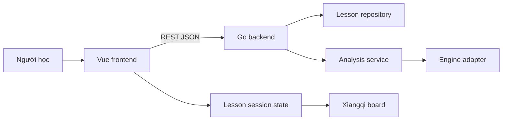

# Tách Go Backend Và Vue Frontend

## Bối Cảnh

Ứng dụng hiện là một Vite/Vue client app một khối. Dữ liệu bài học nằm trong `src/content/lessons.ts`, logic replay bàn cờ nằm trong `src/core/xiangqi.ts`, engine evaluation nằm trong `src/engine/`, và UI gọi trực tiếp `useLessonPlayer` cùng `useMoveEvaluation`.

Trạng thái hiện tại đã đủ tốt cho một prototype chạy client-only, nhưng các yêu cầu gần đây đang đẩy hệ thống sang hướng có backend rõ ràng:

- Kho lesson/wiki ngày càng lớn, cần validate, search, phân loại và có thể cập nhật độc lập UI.
- Engine evaluation đã tích hợp `sl-wukong-engine` trong browser, nhưng package entry chính không export đúng API như README, adapter đang phải import submodule `sl-wukong-engine/dist/core.js`.
- Các tính năng về phân tích nước đi, thế cờ, khai-trung-tàn và wiki có khả năng cần cache, worker, giới hạn tài nguyên và API ổn định.
- Plan đồng bộ state lesson-board vẫn nhấn mạnh source of truth cho phiên học; khi có backend, cần tách rõ source of truth của dữ liệu bài học và source of truth của trạng thái người dùng đang xem.

## Nguyên Nhân Và Lý Do Thiết Kế

Triệu chứng bề mặt là frontend đang ôm quá nhiều việc: render UI, giữ lesson state, chứa toàn bộ content, chuyển FEN, gọi engine, và hiển thị đánh giá. Với quy mô hiện tại vẫn chạy được, nhưng càng thêm data và engine thì bundle client sẽ nặng hơn, logic khó kiểm soát hơn, và việc đổi engine sẽ kéo theo thay đổi UI.

Nguyên nhân trực tiếp là dự án khởi đầu như một static learning app nên mọi dữ liệu và phân tích được đặt trong `src/`. Nguyên nhân gốc rễ là chưa có ranh giới hệ thống giữa “trải nghiệm học trên trình duyệt” và “dịch vụ cung cấp tri thức/phân tích cờ”.

Động lực thiết kế khi tách backend:

- Frontend tập trung vào trải nghiệm học, board interaction, state playhead và theme.
- Backend sở hữu content lesson/wiki, validation, search và API phân tích vị trí.
- Engine chạy trong môi trường kiểm soát được hơn, dễ cache và dễ thay bằng engine mạnh như UCCI/Pikafish/Fairy-Stockfish sau này.
- Data contract được version hóa, tránh component Vue phụ thuộc trực tiếp vào cấu trúc file content nội bộ.

## Góc Nhìn Tổng Quan Và Phạm Vi Tập Trung

Nên tách theo monorepo nhưng giữ triển khai vừa đủ:

```text
co-tuong-wiki/
  frontend/ hoặc apps/web/
  backend/ hoặc apps/api/
  shared/ hoặc docs/contracts/
```

Phạm vi tập trung của bước tách:

- Go backend cung cấp API đọc lesson, lesson detail, search/filter và analyze FEN.
- Vue frontend chuyển từ import `lessons.ts` sang gọi API qua client layer.
- Giữ lesson session/playhead ở frontend để UI vẫn phản hồi nhanh.
- Chuyển engine analysis ra sau API hoặc ít nhất tạo API contract trước, sau đó migrate engine thực tế.
- Giữ Vite dev server và Go API chạy song song trong local development.

Ngoài phạm vi giai đoạn đầu:

- Không cần user account, auth, admin CMS hoặc database phức tạp ngay.
- Không cần rewrite toàn bộ lesson state machine trong cùng lúc.
- Không cần SSR.
- Không cần deploy production phức tạp trước khi API contract ổn.

## Mục Tiêu

- Có backend Go chạy độc lập, expose REST API có schema ổn định.
- Frontend Vue không import trực tiếp lesson dataset cho màn hình chính.
- Backend trả lesson/wiki dưới dạng JSON có thể validate.
- API analyze nhận FEN và trả score/best move theo cùng shape hiện có của `EngineEvaluation`.
- Frontend vẫn giữ trải nghiệm hiện tại: sidebar, board, floating steps, right panel, theme switcher.
- Local dev có lệnh chạy frontend và backend rõ ràng.
- Build frontend không cần bundle engine evaluation nặng nếu analysis đã đi qua backend.

## Ngoài Phạm Vi

- Không chuyển sang microservices.
- Không thêm database nếu file JSON/YAML đủ cho content hiện tại.
- Không bắt frontend phải chờ backend cho mọi click step; board replay vẫn nên ở frontend.
- Không làm engine search sâu nếu chưa chọn engine backend cụ thể.
- Không xử lý multiplayer hoặc chơi với máy đầy đủ.

## Logic Nghiệp Vụ

Backend sở hữu dữ liệu tĩnh và phân tích:

- Lesson catalog: danh sách bài học theo category, difficulty, tags.
- Lesson detail: title, summary, principles, lines, moves, choice.
- Wiki/search: query theo text, category, tag, phase.
- Analysis: nhận FEN, side-to-move, optional context lesson move, trả evaluation.

Frontend sở hữu trạng thái phiên học:

- `activeCategory`
- `activeLessonId`
- `lineId`
- `ply`
- selected/feedback UI
- board projection từ moves đã load

Invariant quan trọng:

- Backend không cần biết người học đang ở UI step nào trừ khi frontend gọi analyze cho FEN hiện tại.
- Frontend không tự sửa content lesson nhận từ API.
- API response phải có `lesson.id`, `line.id`, `move.id` ổn định để state frontend không lệch khi reload.
- Analyze API là stateless ở giai đoạn đầu: cùng FEN và option phân tích phải trả kết quả tương đương hoặc cache được.

## API Contract Đề Xuất

### Lesson API

```http
GET /api/health
GET /api/lessons?category=&q=&tag=&difficulty=
GET /api/lessons/{id}
GET /api/categories
```

`GET /api/lessons` trả catalog nhẹ:

```ts
interface LessonSummaryDto {
  id: string
  slug: string
  title: string
  summary: string
  category: string
  difficulty: string
  tags: string[]
}
```

`GET /api/lessons/{id}` trả detail tương thích với model frontend hiện tại:

```ts
interface LessonDetailDto extends LessonSummaryDto {
  principles: string[]
  lines: LessonLineDto[]
  choice: LessonChoiceDto
}
```

### Analysis API

```http
POST /api/analyze
```

Request:

```ts
interface AnalyzeRequestDto {
  fen: string
  sideToMove: 'red' | 'black'
  nextMove?: {
    from: { file: number; rank: number }
    to: { file: number; rank: number }
    notation?: string
  }
  timeMs?: number
  depth?: number
}
```

Response giữ gần với frontend hiện tại:

```ts
interface AnalyzeResponseDto {
  fen: string
  sideToMove: 'red' | 'black'
  score: {
    cp: number
    perspective: 'red' | 'black'
  }
  bestMove?: {
    from: { file: number; rank: number }
    to: { file: number; rank: number }
    notation: string
    score?: number
  }
  principalVariation: Array<{
    from: { file: number; rank: number }
    to: { file: number; rank: number }
    notation: string
    score?: number
  }>
  depth: number
  source: 'uci' | 'wukong'
  message?: string
}
```

## Cấu Trúc Giải Pháp

Đề xuất cấu trúc:

```text
apps/
  web/
    src/
    package.json
    vite.config.ts
  api/
    cmd/server/main.go
    internal/http/
    internal/lessons/
    internal/xiangqi/
    internal/analysis/
    data/lessons/
docs/
  specs/
  contracts/
```

Nếu muốn diff ban đầu nhỏ hơn, có thể dùng:

```text
frontend/
backend/
```

Nhưng `apps/web` và `apps/api` dễ mở rộng hơn nếu sau này có admin tool hoặc worker.

## Mô Hình C4



## Hướng Tiếp Cận Đề Xuất

Nên tách backend theo 4 phase để tránh vỡ app:

## Trạng Thái Triển Khai Hiện Tại

Dự án hiện đã tách thành monorepo:

- `apps/web`: Vue/Vite frontend.
- `apps/api`: Go backend dùng `net/http`.
- `apps/api/data/lessons/lessons.json`: lesson catalog được backend load và validate khi khởi động.
- Root `package.json` cung cấp scripts `dev:web`, `dev:api`, `build:web`, `test:api`.
- `go.work` cho phép chạy test backend từ root.

Frontend hiện gọi backend qua `VITE_API_URL`:

- `GET /api/categories`
- `GET /api/lessons`
- `GET /api/lessons/{id}`
- `POST /api/analyze`

Engine Wukong đã được tháo khỏi bundle frontend. `/api/analyze` hiện yêu cầu một engine UCI cờ tướng được cấu hình bằng `ENGINE_PATH`; backend trả lỗi cấu hình nếu thiếu engine thay vì dùng heuristic fallback.

### Phase 1: Monorepo Và Backend Skeleton

Tạo `apps/web` từ app Vue hiện tại hoặc giữ tạm root frontend rồi chuẩn bị `apps/api`. Backend Go dùng thư viện chuẩn `net/http` hoặc router nhẹ như `chi`. Với scope hiện tại, `net/http` đủ; `chi` chỉ cần nếu muốn middleware/router sạch hơn.

Backend có:

- `/api/health`
- cấu hình CORS cho local dev
- logging tối thiểu
- JSON error response nhất quán

### Phase 2: Di Chuyển Lesson Data Sang Backend

Chuyển lesson content từ TypeScript sang JSON/YAML trong `apps/api/data/lessons/`. Backend load file khi start, validate id/line/move, expose catalog/detail API.

Frontend thêm `src/api/client.ts` và composable `useLessons` để fetch data. Trong giai đoạn chuyển đổi có thể giữ fallback static data để dev không bị trắng màn hình khi API chưa chạy, nhưng fallback phải nằm ở API client boundary.

### Phase 3: Analysis API

Đưa contract `POST /api/analyze` vào backend bằng engine process. Backend Go không chạy package Node `sl-wukong-engine`; thay vào đó, `internal/analysis` gọi binary UCI cờ tướng qua stdin/stdout, parse `info` và `bestmove`, rồi chuẩn hóa response về contract frontend.

Nếu `ENGINE_PATH` chưa được cấu hình hoặc engine lỗi, endpoint trả lỗi HTTP thay vì tự tạo điểm heuristic. Điều này tránh UI hiểu nhầm điểm vật chất là đánh giá search thật.

### Phase 4: Dọn Frontend Engine Client-Side

Khi `/api/analyze` ổn:

- `useMoveEvaluation` gọi API thay vì `wukongAdapter`.
- Xóa `sl-wukong-engine` khỏi frontend dependency nếu không còn dùng.
- Giữ `fen.ts` ở frontend nếu board replay vẫn cần sinh FEN để gọi API.
- Có thể chuyển một phần shared DTO sang generated types hoặc copy contract rõ trong `docs/contracts`.

## Chi Tiết Triển Khai

### Backend Go

Module backend nên có các package nội bộ:

- `internal/http`: routing, JSON helpers, error response, CORS.
- `internal/lessons`: repository load/validate/search lesson data.
- `internal/xiangqi`: DTO tọa độ, FEN validation cơ bản, helper move notation nếu cần.
- `internal/analysis`: service nhận request analyze và gọi evaluator.
- `cmd/server`: wiring config và start server.

File content nên đặt trong `apps/api/data/lessons/*.json` để không cần database ngay. Mỗi lesson có schema gần với `Lesson` hiện tại.

### Frontend Vue

Frontend cần một API boundary:

- `src/api/types.ts`: DTO từ backend.
- `src/api/client.ts`: `fetchJson`, base URL từ `VITE_API_URL`.
- `src/composables/useLessons.ts`: load categories, visible lessons, active lesson detail.
- `src/composables/useMoveEvaluation.ts`: chuyển adapter local sang API call.

`useLessonPlayer` vẫn nên nhận `Lesson` đã load và tiếp tục là source of truth của playhead.

### Local Development

Đề xuất scripts:

```json
{
  "dev:web": "npm --prefix apps/web run dev",
  "dev:api": "go run ./apps/api/cmd/server",
  "build:web": "npm --prefix apps/web run build",
  "test:api": "go test ./apps/api/..."
}
```

Nếu không muốn dùng root scripts ngay, có thể ghi rõ trong README:

```sh
cd apps/api && go run ./cmd/server
cd apps/web && npm run dev
```

### CORS Và Config

Local dev:

- Backend mặc định chạy `http://127.0.0.1:8090`.
- Frontend Vite chạy `http://127.0.0.1:517x`.
- `VITE_API_URL=http://127.0.0.1:8090`.
- CORS chỉ allow localhost dev origin, không mở wildcard trong production.

### Data Migration

Vì `lessons.ts` hiện chứa cả content và TypeScript type, cách an toàn là:

1. Giữ type shape hiện tại làm schema nguồn.
2. Convert lesson data sang JSON.
3. Backend validate required fields.
4. Frontend dùng DTO tương đương để giảm diff UI.
5. Sau khi API ổn, xóa import `lessons` trực tiếp khỏi `App.vue`.

## Công Việc Cần Làm

1. Tạo cấu trúc monorepo `apps/web` và `apps/api`, hoặc chuẩn bị backend trong `apps/api` trước rồi move frontend sau.
2. Scaffold Go module trong `apps/api`.
3. Tạo HTTP server với `/api/health`.
4. Chuyển lesson data sang JSON trong backend.
5. Implement lesson repository và các endpoint catalog/detail/categories.
6. Thêm API client trong Vue và thay data import bằng fetch.
7. Implement `/api/analyze` bằng engine UCI process có parser và timeout.
8. Đổi `useMoveEvaluation` sang gọi `/api/analyze`.
9. Xóa hoặc giữ fallback frontend engine theo feature flag trong giai đoạn chuyển đổi.
10. Cập nhật README/dev scripts.
11. Thêm test backend cho lesson validation và analyze contract.
12. Chạy validation cả hai bên.

## Rủi Ro Và Ràng Buộc

- Tách quá sớm có thể làm dev workflow nặng hơn nếu chưa có script chạy song song.
- Nếu move frontend folder lớn trong repo chưa commit, diff sẽ lớn và khó review. Nên cân nhắc commit baseline trước hoặc tách phase.
- Backend Go không dùng trực tiếp được `sl-wukong-engine` như dependency tự nhiên; cần chiến lược engine riêng.
- Nếu API DTO drift khỏi model Vue, lesson player dễ lỗi runtime. Cần type mapping rõ.
- Nếu analysis đi qua network cho mỗi step mà không debounce/cache, UI sẽ chậm hơn client-only.
- CORS/config sai sẽ làm local dev có vẻ “hỏng app” dù backend chạy đúng.

## Kiểm Chứng

- `go test ./apps/api/...` pass.
- Backend `/api/health` trả OK.
- `GET /api/lessons` trả đúng số bài hiện có.
- `GET /api/lessons/{id}` trả đủ `lines`, `moves`, `choice`, `principles`.
- Frontend load catalog/detail từ API và vẫn render sidebar, board, floating steps.
- Đổi category/lesson/line không làm board lệch playhead.
- `POST /api/analyze` trả evaluation đúng schema.
- Khi backend tắt, frontend hiển thị lỗi có kiểm soát thay vì trắng màn hình.
- `npm run build` hoặc script build web pass.
- Nếu monorepo move frontend, mọi path asset/import còn đúng.
