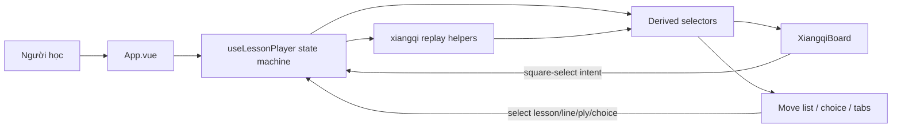

# Đồng Bộ State Lesson Và Bàn Cờ

## Bối Cảnh

Ứng dụng hiện là monorepo nhỏ gồm Go API trong `apps/api` và Vue frontend trong `apps/web`. Backend load dữ liệu bài học từ `apps/api/data/lessons/lessons.json`, validate dữ liệu bằng Go tests, và expose API lesson/analysis. Frontend dùng `useLessons` để đọc lesson qua API, `useLessonPlayer` để giữ line/playhead hiện tại, `XiangqiBoard.vue` để render bàn cờ, và `apps/web/src/core/xiangqi.ts` để replay nước đi từ bàn cờ chuẩn hoặc `initialFen` của từng lesson.

Repo vẫn đang ở trạng thái chưa có committed `HEAD`, nên kế hoạch này dựa trên working tree hiện tại và docs sync state trong `docs/_sync.md` thay vì lịch sử Git.

Triệu chứng người dùng báo: state của lesson đang sync không đúng với bàn cờ tướng và ngược lại. Qua code hiện tại có các điểm đáng chú ý:

- `useLessonPlayer` vẫn giữ `activeLineId`, `activeMoveIndex`, `selectedChoice` dưới dạng các ref rời.
- `board` là computed state được dựng bằng `replayMoves(initialLessonBoard, visibleMoves)`, trong đó `initialLessonBoard` lấy từ `initialFen` nếu lesson khai báo, nếu không dùng bàn cờ chuẩn.
- `XiangqiBoard` nhận `board` và `currentMove`, highlight from/to của nước hiện tại, nhưng chưa emit sự kiện click quân/ô.
- UI điều khiển lesson gọi trực tiếp `setLine`, `goToMove`, `chooseMove`, `previous`, `next`.
- `MoveGraph` đã đọc cùng playhead từ player và click node graph điều hướng line/ply, nhưng state session vẫn chưa gom thành một transaction object.
- Khi đổi lesson/category, watcher reset line/index nhưng không có một state transaction duy nhất mô tả vì sao reset.
- Khi chọn line khác, code giữ `activeMoveIndex` theo số bước cũ nếu còn trong range, dù line mới có thể là biến hóa khác. Board vì vậy có thể nhảy sang một trạng thái cùng index nhưng khác ngữ nghĩa.
- Khi chọn đáp án bằng `moveId`, player tìm line chứa move rồi đặt index theo vị trí move đó, nhưng chưa có playhead chuẩn để ràng buộc board click, move graph, current move, choice feedback và selected square cùng một thời điểm.

## Nguyên Nhân Và Lý Do Thiết Kế

Triệu chứng là UI lesson, move list, choice và board đôi khi không phản ánh cùng một “thời điểm” trong bài học. Nguyên nhân trực tiếp là state lesson hiện bị tách thành nhiều ref nhỏ và thao tác cập nhật rải rác ở nhiều action.

Nguyên nhân gốc rễ là ứng dụng chưa có một mô hình phiên học duy nhất làm nguồn sự thật. Board đang là kết quả replay một chiều từ index, nhưng board component chưa có contract ngược để báo người học chọn quân/ô/nước nào. Khi UI phát triển thêm nhiều nguồn input như select lesson, tab line, move list, previous/next, choice option và click board, nếu không có state machine rõ ràng thì mỗi input sẽ tự cập nhật một phần state, dẫn đến lệch.

Động lực thiết kế là biến lesson player thành một state machine nhỏ, trong đó mọi tương tác đều đi qua một reducer/action layer. Board chỉ là projection từ state phiên học, còn các click trên board được dịch thành intent rồi gửi lại cùng action layer đó. Như vậy lesson và board không cố sync lẫn nhau bằng watcher rời rạc; chúng cùng đọc/ghi qua một nguồn sự thật.

## Góc Nhìn Tổng Quan Và Phạm Vi Tập Trung

Phạm vi tập trung:

- Thiết kế lại state trong `useLessonPlayer` để có một `LessonSessionState` duy nhất.
- Tạo các selector/computed chuẩn cho board, current move, active line, visible moves, selected square, legal/expected targets, feedback.
- Thêm event contract từ `XiangqiBoard` về player khi người dùng click ô/quân.
- Chuẩn hóa cách chọn lesson/category/line/move/choice sao cho board và lesson luôn reset hoặc giữ trạng thái theo rule rõ ràng.
- Thêm validation/test tối thiểu cho replay và sync state.

Ngoài phạm vi trong bước này:

- Không xây engine luật cờ tướng đầy đủ.
- Không hỗ trợ người dùng đi nước tự do ngoài các nước/choice đã khai báo trong lesson.
- Không thêm backend, persistence phức tạp hoặc routing sâu.
- Không sửa toàn bộ nội dung lesson nếu chỉ cần thêm metadata nhỏ để sync.

## Mục Tiêu

- Có một source of truth cho phiên học.
- Mọi UI input cập nhật state qua action có tên rõ ràng.
- Board render đúng theo `lessonId + lineId + ply`.
- Move list active, counter, highlighted move và board luôn trùng nhau.
- Chọn lesson/category reset phiên học về trạng thái đầu bài.
- Chọn line có rule rõ: mặc định về đầu line hoặc giữ prefix chung nếu line có chung nhánh.
- Chọn choice cập nhật line, ply, feedback và board cùng lúc.
- Click board có thể chọn quân/ô và nếu trùng nước tiếp theo hoặc option hợp lệ thì advance state.
- Có test hoặc script phát hiện lesson line không replay được và state transition sai.

## Ngoài Phạm Vi

- Không kiểm tra luật đi hợp lệ đầy đủ cho mọi quân.
- Không cho kéo thả quân tự do.
- Không tự động suy luận move từ ký pháp tiếng Việt.
- Không lưu tiến độ học dài hạn trong localStorage ở bước đầu.
- Không thêm route URL cho từng ply, trừ khi sau này cần share link trạng thái.

## Logic Nghiệp Vụ

State phiên học nên có dạng khái niệm:

```ts
interface LessonSessionState {
  lessonId: string
  lineId: string
  ply: number
  selectedSquare: Coordinate | null
  pendingMoveId: string | null
  answeredChoiceId: string | null
  feedback: ChoiceFeedback | null
}
```

Các invariant quan trọng:

- `lessonId` luôn tồn tại trong `lessons`.
- `lineId` luôn thuộc `lesson.lines`.
- `ply` nằm trong khoảng `0..activeLine.moves.length`.
- `visibleMoves = activeLine.moves.slice(0, ply)`.
- `board = replayMoves(initialLessonBoard, visibleMoves)`, với `initialLessonBoard` lấy từ `initialFen` hoặc bàn cờ chuẩn.
- `currentMove = activeLine.moves[ply - 1] || null`.
- `nextMove = activeLine.moves[ply] || null`.
- `counter = ply / activeLine.moves.length`.
- `selectedSquare` không được trỏ vào quân/ô đã biến mất sau khi đổi ply, line hoặc lesson.
- `feedback` chỉ hiện nếu action gần nhất là chọn choice hoặc board click khớp một choice.

Quy tắc transition:

- `SELECT_LESSON`: đổi lesson, chọn line đầu tiên, `ply = 0`, clear selection và feedback.
- `SELECT_CATEGORY`: chọn lesson đầu tiên trong category, rồi chạy cùng rule `SELECT_LESSON`.
- `SELECT_LINE`: đổi line. Đề xuất rule giai đoạn đầu là reset `ply = 0` để tránh cùng index nhưng khác ngữ nghĩa. Sau này có thể giữ prefix chung bằng `move.id`.
- `GO_TO_PLY`: clamp ply vào range, clear selection, giữ feedback chỉ khi ply vẫn đúng move đã chọn; đơn giản hơn là clear feedback.
- `NEXT`/`PREVIOUS`: gọi `GO_TO_PLY`.
- `CHOOSE_MOVE`: tìm move trong các line của lesson, chuyển line và ply đến sau move đó, set feedback từ option.
- `BOARD_SELECT_SQUARE`: nếu chưa có selected square và square có quân của side cần đi, lưu selected square.
- `BOARD_SELECT_SQUARE` lần hai: nếu cặp from/to khớp `nextMove` thì advance `ply + 1`; nếu khớp option choice thì chạy `CHOOSE_MOVE`; nếu không khớp thì update/clear selected square theo rule rõ.

## Cấu Trúc Giải Pháp

Đề xuất chia lớp như sau:

- `apps/web/src/core/xiangqi.ts`: giữ `applyMove`, `replayMoves`, `pieceAt`, thêm helper `coordinateKey`, `findMoveBySquares`, `isSameMoveShape`.
- `apps/web/src/composables/useLessonPlayer.ts`: trở thành state machine cho phiên học, expose state/action/selectors.
- `apps/web/src/components/XiangqiBoard.vue`: nhận thêm `selectedSquare`, `expectedMove`, `candidateTargets`; emit `square-select`.
- `apps/web/src/App.vue`: không tự thao tác nhiều ref lesson player nữa; gọi action của player hoặc một hàm điều phối `selectLesson`, `selectCategory`.
- `apps/api/data/lessons/lessons.json`: tiếp tục giữ id ổn định cho lesson, line, move và choice option.

## Mô Hình C4



## Hướng Tiếp Cận Đề Xuất

Không nên vá bằng watcher riêng lẻ giữa board và lesson. Hướng đúng là:

1. Gom state phiên học vào một object/ref duy nhất.
2. Định nghĩa action API như một reducer nhỏ.
3. Biến board, current move, visible moves, feedback thành derived state.
4. Cho mọi UI input gọi action thay vì set ref trực tiếp.
5. Thêm event từ board về action layer.
6. Viết validation để state và board không thể lệch im lặng.

Vì app chưa dùng Pinia và scope còn nhỏ, chưa cần thêm dependency state management. Một composable reducer thuần Vue là đủ. Nếu sau này có nhiều màn hình, có thể chuyển cùng contract này sang Pinia.

## Chi Tiết Triển Khai

### 1. Chuẩn Hóa State

Trong `useLessonPlayer`, thay các ref rời:

- `activeLineId`
- `activeMoveIndex`
- `selectedChoice`

bằng:

```ts
const state = reactive<LessonSessionState>({
  lessonId: lesson.value.id,
  lineId: lesson.value.lines[0]?.id ?? '',
  ply: 0,
  selectedSquare: null,
  pendingMoveId: null,
  answeredChoiceId: null,
  feedback: null,
})
```

Expose computed aliases để App không phải biết chi tiết object:

- `activeLine`
- `activeMoves`
- `visibleMoves`
- `board`
- `currentMove`
- `nextMove`
- `counter`
- `feedback`
- `selectedSquare`
- `expectedMove`

Trong giai đoạn chuyển đổi, có thể giữ tên cũ như `activeLineId` và `activeMoveIndex` dưới dạng computed readonly để giảm diff UI.

### 2. Action API

Tạo các action rõ nghĩa:

```ts
selectLesson(lessonId: string)
selectLine(lineId: string)
goToPly(ply: number)
next()
previous()
chooseMove(moveId: string)
selectSquare(coordinate: Coordinate)
clearSelection()
```

Mỗi action tự đảm bảo invariant. Không component nào được set `state.lineId` hoặc `state.ply` trực tiếp.

### 3. Lesson Selection

Hiện `App.vue` có `activeCategory`, `activeLessonId`, `lesson = computed(...)`, rồi truyền `lesson` vào player. Cách này tạo hai nguồn state: App giữ lesson id, player giữ line/ply. Đề xuất:

- App vẫn giữ `activeCategory` vì đây là navigation ngoài player.
- `activeLessonId` nên được cập nhật qua `player.selectLesson(id)` hoặc `useLessonPlayer` nhận `lessonId` và tự resolve lesson.
- Nếu muốn ít diff, giữ `activeLessonId` ở App nhưng thêm watcher một chiều:
  - App đổi `activeLessonId` -> gọi `player.selectLessonByObject(lesson.value)` hoặc reset session bằng action duy nhất.
  - Không để watcher trong player reset lặng lẽ mà không qua action.

Ưu tiên dài hạn: `useLessonPlayer(lessons, initialLessonId)` quản lý `lessonId` nội bộ, App chỉ đọc `player.lesson`.

### 4. Board Interaction

`XiangqiBoard.vue` hiện render button cho từng square nhưng chưa emit. Cần thêm:

```ts
const emit = defineEmits<{
  squareSelect: [coordinate: Coordinate]
}>()
```

Mỗi square click emit coordinate. Board nhận:

- `selectedSquare`
- `expectedMove`
- `candidateTargets`

Board không tự quyết định state lesson. Nó chỉ phát intent.

Trong player:

- Nếu click source của `nextMove`, chọn source.
- Nếu đã chọn source và click target của `nextMove`, gọi `next()`.
- Nếu click cặp source/target của một choice option, gọi `chooseMove`.
- Nếu click quân khác cùng side cần đi, đổi selected square.
- Nếu click ngoài ngữ cảnh, clear selection.

### 5. Highlight Và UI Consistency

Board cần highlight:

- From/to của `currentMove`.
- `selectedSquare`.
- Target của `nextMove` khi source đã chọn.
- Optional: các option choice target nếu đang ở ply trước choice.

Move list active phải dùng `ply`, không dùng index độc lập.

Choice feedback phải liên kết với state:

- Khi `chooseMove(moveId)`, set `feedback` theo option.
- Khi user `previous`, `goToPly`, `selectLine`, `selectLesson`, clear feedback.
- Khi user click board khớp option, feedback hiện giống click button.

### 6. Data Validation

Backend hiện đã có validation trong `apps/api/internal/lessons/validation_test.go`, chạy qua `go test ./apps/api/...`. Validation này kiểm replay lesson từ bàn cờ chuẩn hoặc `initialFen`, source square, target square, luật quân cơ bản, hai tướng nhìn nhau và choice option trỏ tới move tồn tại.

Nếu cần mở rộng validation phía frontend, có thể thêm script nhẹ dùng lại `apps/web/src/core/xiangqi.ts` để kiểm các selector/UI transition, nhưng không cần duplicate toàn bộ luật cờ đã có trong Go test.

Validation hiện cần tiếp tục đảm bảo:

- Replay mọi line của mọi lesson.
- Kiểm tra mọi `choice.options[].moveId` tồn tại trong ít nhất một line của lesson.
- Kiểm tra mỗi lesson có ít nhất một line, mỗi move có id.
- Kiểm tra `from` có quân đúng side tại thời điểm move.
- Kiểm tra `to` không có quân cùng side.

Không cần engine luật đầy đủ nhưng cần chặn lỗi sync do data không replay được.

### 7. Test Mục Tiêu

Frontend hiện chưa có test framework riêng ngoài build. Nếu triển khai state machine và board click, có hai lựa chọn:

- Cài Vitest và viết unit test cho `useLessonPlayer` + `xiangqi`.
- Hoặc tạo script TypeScript chạy bằng `tsx`/`vite-node` nếu muốn nhẹ.

Đề xuất cài Vitest vì state machine nên được test lâu dài. Test cần có:

- `selectLesson` reset line/ply/feedback/selection.
- `selectLine` reset ply về 0.
- `goToPly` clamp đúng.
- `chooseMove` chuyển đúng line và ply.
- `selectSquare` click source/target của `nextMove` làm board advance.
- Replay full line không lỗi.
- Choice option move id đều tồn tại.

## Công Việc Cần Làm

1. Tạo type `LessonSessionState` và helper transition trong `useLessonPlayer`.
2. Chuyển state rời sang object state có action API.
3. Cập nhật `App.vue` để không set state player trực tiếp; dùng action cho lesson, line, ply, choice.
4. Cập nhật `XiangqiBoard.vue` để emit square select và nhận selected/expected highlights.
5. Thêm helper trong `xiangqi.ts` cho coordinate matching và move matching.
6. Thêm unit tests hoặc script validation cho state sync frontend nếu board click được triển khai.
7. Chạy build và validation.
8. Kiểm tra browser các flow chính: đổi category, đổi lesson select, đổi line, next/prev, click move list, chọn choice, click board để đi nước tiếp theo.

## Rủi Ro Và Ràng Buộc

- Dữ liệu lesson hiện được sinh từ nhiều helper và có thể có move id tự sinh. Action `chooseMove` phải dựa vào id ổn định đã tạo tại runtime; không nên dựa vào label.
- Một số line chia sẻ prefix nhưng move id khác do được build bằng prefix line khác. Nếu muốn giữ prefix khi đổi line, cần matching theo from/to/notation thay vì id. Giai đoạn đầu nên reset ply về 0 khi đổi line để tránh sai.
- Board click dễ gây kỳ vọng như chơi cờ tự do. UI nên chỉ hỗ trợ “đi theo lesson/choice”, chưa giả làm engine cờ.
- Nếu thêm Vitest sẽ tăng dependency nhưng đáng giá vì lỗi sync state rất dễ tái phát.
- Nếu chỉ thêm script validation mà không test composable, lỗi action UI vẫn có thể lọt.

## Kiểm Chứng

Validation tối thiểu sau triển khai:

- `npm run build:web` pass.
- `npm run test:api` pass.
- Test state machine pass nếu thêm unit test frontend.
- Browser flow:
  - Chọn category mới: select lesson, board, counter, move list đều reset.
  - Chọn lesson trong dropdown: board về initial, counter `0/n`, feedback clear.
  - Chọn line khác: board về initial hoặc rule prefix chung đã định, move list active đúng.
  - Bấm next/prev: board, counter, current move highlight cùng thay đổi.
  - Bấm move list: board replay đến đúng ply.
  - Bấm choice: đổi line nếu cần, board đến đúng move, feedback đúng.
  - Click board theo `nextMove.from` rồi `nextMove.to`: lesson advance một ply.
  - Click board sai target: không làm board và lesson lệch.

## Tiêu Chí Chấp Nhận

- Không còn component nào tự tạo trạng thái bàn cờ riêng ngoài projection từ player.
- Không còn thao tác UI nào cập nhật một phần lesson state mà không qua action.
- Board và lesson có cùng playhead duy nhất.
- Người dùng có thể điều khiển bài học từ cả lesson UI và board mà kết quả giống nhau.
- Khi data lesson sai, validation báo lỗi rõ thay vì để runtime lệch âm thầm.
