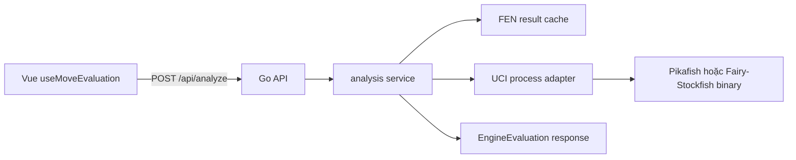

# Dùng Engine Mạnh Cho Đánh Giá Cờ Tướng

## Bối Cảnh

Ứng dụng hiện đã có luồng đánh giá vị trí hoàn chỉnh ở mức contract:

- Frontend sinh Xiangqi FEN từ trạng thái bàn cờ hiện tại.
- `useMoveEvaluation` debounce request và gọi `POST /api/analyze`.
- Backend Go nhận FEN, `sideToMove`, `nextMove`, rồi trả `score`, `bestMove`, `principalVariation`, `depth`, `source` và `message`.
- `EvaluationPanel.vue` hiển thị điểm, best move, độ sâu và nhận xét so với nước trong bài học.

Backend hiện đã chuyển sang engine UCI bắt buộc: `apps/api/internal/analysis` đọc `ENGINE_PATH`, chạy binary engine, parse `info`/`bestmove`, chuẩn hóa score về góc nhìn Đỏ và trả `source: 'uci'`. Khi thiếu cấu hình engine, `/api/analyze` trả lỗi rõ thay vì tự tạo điểm heuristic.

Docs hiện có đã dự phòng hướng này:

- `integrate-xiangqi-engine-evaluation.md` ghi rõ heuristic chỉ là bước ban đầu; trạng thái hiện tại đã chọn engine ngoài ở backend.
- `split-go-backend-vue-frontend.md` đã chốt sau khi tách backend, hướng sạch hơn là Go backend gọi engine ngoài qua process UCI/UCCI, ví dụ Pikafish hoặc Fairy-Stockfish, thay vì đưa engine vào browser.

Nguồn engine đã kiểm tra:

- Pikafish là engine cờ tướng mạnh theo protocol UCI, dẫn xuất từ Stockfish, giấy phép GPL-3.0.
- Fairy-Stockfish hỗ trợ Xiangqi và nhiều biến thể, hỗ trợ UCI/UCCI/USI/XBoard, giấy phép GPL-3.0.
- Cả hai không phải thư viện Go native; cách tích hợp phù hợp là chạy binary/engine process và giao tiếp bằng stdin/stdout.

## Nguyên Nhân Và Lý Do Thiết Kế

Triệu chứng cần tránh là panel hiển thị một score vật chất như thể đó là engine search thật. Vì vậy implementation hiện tại không còn fallback heuristic trong `/api/analyze`.

Nguyên nhân trực tiếp:

- Backend dùng adapter engine process theo từng request để việc hủy timeout chắc chắn.
- Contract `Analyze` chỉ trả kết quả khi engine UCI chạy được; lỗi cấu hình đi ra HTTP thay vì response giả.
- Adapter đã có bước init protocol, set position, search, timeout và parse output tối thiểu.

Nguyên nhân gốc rễ:

- Dự án đã chuẩn hóa FEN/API trước, nhưng chưa chọn engine runtime và boundary vận hành.
- Engine mạnh thường là binary GPL và chạy dài hạn; nếu nhúng thẳng vào frontend hoặc gọi ad hoc mỗi request sẽ tạo rủi ro license, hiệu năng, độ ổn định và UX.

Lý do chọn backend engine process:

- Giữ browser nhẹ, không phải tải WASM/NNUE lớn.
- Backend dễ cache kết quả theo FEN và giới hạn tài nguyên.
- Có thể thay Pikafish bằng Fairy-Stockfish hoặc engine khác sau này mà không đổi UI.
- Phù hợp với trạng thái repo hiện tại: `/api/analyze` đã là boundary tự nhiên.

## Góc Nhìn Tổng Quan Và Phạm Vi Tập Trung

Phạm vi tập trung là `analysis.Analyze()` dùng UCI process:

- `uci`: engine mạnh chạy qua process, đề xuất mặc định là Pikafish nếu binary có sẵn.
- `fairy-stockfish`: lựa chọn thay thế nếu cần UCCI hoặc kiểm chứng biến thể tốt hơn.
- Không có heuristic fallback trong response phân tích.

Không thay đổi trải nghiệm lesson chính. Frontend chỉ cần hiểu thêm `source`, `depth`, `principalVariation`, lỗi timeout và trạng thái fallback.

## Mục Tiêu

- `/api/analyze` trả best move thật từ engine mạnh khi engine được cấu hình.
- Score có depth và principal variation ngắn, không còn giả best move từ `nextMove`.
- Nếu engine lỗi, timeout hoặc chưa được cấu hình, API trả lỗi HTTP rõ.
- Backend không treo request vô hạn và không spawn process vô tội vạ.
- Contract frontend hiện tại chỉ đổi tối thiểu.
- Có test cho parser output, timeout/fallback và contract response.

## Ngoài Phạm Vi

- Không xây engine cờ tướng từ đầu.
- Không thêm chế độ chơi với máy.
- Không yêu cầu phân tích nhiều biến sâu như GUI chuyên nghiệp.
- Không tự động tải binary engine từ internet trong runtime production.
- Không chốt nghĩa vụ pháp lý GPL thay cho quyết định phát hành sản phẩm; plan chỉ nêu ràng buộc kỹ thuật cần xử lý.

## Logic Nghiệp Vụ

Request phân tích vẫn đi qua:

```http
POST /api/analyze
```

Input tối thiểu:

```ts
{
  fen: string
  sideToMove: 'red' | 'black'
  nextMove?: LessonMove
  timeMs?: number
  depth?: number
}
```

Quy tắc chạy:

- Nếu `ENGINE_KIND=uci` và `ENGINE_PATH` hợp lệ, dùng engine process.
- Nếu request có `timeMs`, giới hạn search theo thời gian; nếu không, dùng default ngắn để UI học bài phản hồi nhanh.
- Nếu request có `depth`, giới hạn theo depth nhưng vẫn cần timeout cứng.
- Nếu engine trả `bestmove`, map notation engine về `{ from, to, notation }`.
- Nếu engine trả `info depth ... score cp ... pv ...`, lấy depth cao nhất, score mới nhất và PV đầu tiên.
- Nếu engine trả mate score, response contract hiện chưa có `mate`; giai đoạn đầu có thể quy đổi sang cp lớn có message, hoặc mở rộng contract sau khi UI được cập nhật.
- Nếu engine không trả kết quả hợp lệ, trả lỗi để UI hiển thị trạng thái phân tích lỗi.

Score nên tiếp tục dùng `perspective: 'red'` để khớp UI hiện tại. Nếu engine trả score theo side-to-move, backend phải chuẩn hóa dấu:

- Score dương nghĩa là Đỏ tốt hơn.
- Score âm nghĩa là Đen tốt hơn.

## Cấu Trúc Giải Pháp

Đề xuất giữ package `internal/analysis` nhưng tách rõ các lớp:

```text
apps/api/internal/analysis/
  service.go          # public Analyze entrypoint, đọc config và áp timeout
  types.go            # Request/Response/Move/Score nếu cần tách khỏi service
  engine.go           # interface Analyzer/Engine nếu có thêm backend khác
  uci.go              # process protocol, command queue, parser
  uci_parser.go       # parse info/bestmove độc lập để test dễ
  config.go           # env config: ENGINE_KIND, ENGINE_PATH, limits
```

Interface nội bộ:

```go
type Analyzer interface {
    Analyze(ctx context.Context, request Request) (Response, error)
}
```

`service.go` chịu trách nhiệm:

- Validate FEN tối thiểu.
- Chọn analyzer theo config.
- Bọc context timeout.
- Trả lỗi rõ khi engine chưa cấu hình hoặc analyzer mạnh lỗi.
- Gắn message giải thích nguồn phân tích.

## Mô Hình C4



Cache là tùy chọn nhưng nên chuẩn bị boundary từ đầu vì người học có thể bấm qua lại cùng một ply nhiều lần.

## Hướng Tiếp Cận Đề Xuất

Nên ưu tiên **Pikafish qua UCI process** làm hướng mặc định cho engine mạnh.

Lý do:

- Pikafish là engine chuyên cờ tướng, không phải engine biến thể tổng quát.
- Protocol UCI đủ gần với contract cần có: `position fen ...`, `go movetime/depth`, `info`, `bestmove`.
- Backend Go đọc stdin/stdout process là hướng rõ và kiểm thử được.

Fairy-Stockfish giữ vai trò phương án B:

- Hữu ích nếu cần engine có hỗ trợ UCCI/variant rộng hơn.
- Cũng GPL-3.0, nên không giải quyết bài toán license tốt hơn Pikafish.
- Có thể phức tạp hơn vì cần set variant đúng cho Xiangqi.

## Chi Tiết Triển Khai

### 1. Chuẩn Hóa Config Engine

Thêm cấu hình qua biến môi trường:

```text
ENGINE_KIND=uci
ENGINE_PATH=/absolute/path/to/pikafish
ENGINE_DEFAULT_TIME_MS=500
ENGINE_MAX_TIME_MS=2000
ENGINE_DEFAULT_DEPTH=8
ENGINE_MAX_DEPTH=12
ENGINE_CACHE_SIZE=256
```

Khi `ENGINE_KIND` rỗng, backend mặc định hiểu là `uci`. `ENGINE_PATH` là bắt buộc để `/api/analyze` trả kết quả.

### 2. Không Dùng Heuristic Fallback

Backend không tự tạo score từ vật chất và không gắn `bestMove` bằng `nextMove`. Nếu chưa cấu hình `ENGINE_PATH`, engine timeout, hoặc output không parse được, handler trả lỗi để frontend hiển thị `Lỗi phân tích`.

### 3. Tạo UCI Process Adapter

Adapter hiện chạy một process theo từng request:

- Hủy request bằng context timeout sẽ kill process dứt khoát.
- Không trộn output giữa hai analysis song song.
- Phù hợp bước đầu khi frontend đã debounce request.

Luồng khởi tạo:

```text
start process
uci
wait uciok
isready
wait readyok
```

Luồng analyze:

```text
ucinewgame
position fen <fen>
go movetime <timeMs>
read info lines
read bestmove <move>
```

Nếu dùng depth:

```text
go depth <depth>
```

Vẫn đặt context timeout lớn hơn `timeMs` một chút để tránh treo.

### 4. Parse Output Và Map Move

Parser cần hỗ trợ tối thiểu:

```text
info depth 8 score cp 123 pv h2e2 h9g7
info depth 9 score mate 3 pv ...
bestmove h2e2
```

Map notation:

- Engine notation dạng `a0a1` tương thích helper frontend hiện tại.
- Backend có thể trả notation và coordinate cùng lúc để UI không tự parse lại.
- Nếu promotion/drop không tồn tại với Xiangqi thường, bỏ qua case đó ở giai đoạn đầu.

### 5. Mở Rộng Type Frontend Nhẹ

`EngineSource` hiện nhận `'uci' | 'wukong'`.

Panel nên hiển thị:

- `UCI sẵn sàng` khi `source === 'uci'`.
- `Depth` thật từ engine.
- PV ngắn nếu muốn hiển thị thêm sau này.

Nếu engine lỗi hoặc chưa cấu hình, panel hiển thị trạng thái lỗi từ API client.

### 6. License Và Phân Phối Binary

Pikafish và Fairy-Stockfish đều GPL-3.0. Nếu repo/app được phân phối kèm binary engine, cần:

- Ghi license của engine.
- Cung cấp source hoặc pointer đến source tương ứng.
- Không giấu engine như một dependency đóng.

Để giảm rủi ro ở giai đoạn đầu:

- Không commit binary engine vào repo.
- Chỉ cấu hình `ENGINE_PATH` trỏ tới binary local.
- Ghi docs setup dev riêng cho engine path.
- Nếu sau này đóng gói production, xử lý license trong một task riêng.

## Công Việc Cần Làm

1. Tách `apps/api/internal/analysis/service.go` thành types, config và service orchestration.
2. Thêm config đọc env cho engine kind/path/time/depth/cache.
3. Implement `UCIAnalyzer` chạy binary engine qua `os/exec`.
4. Implement parser cho `info`, `score cp`, `score mate`, `pv`, `bestmove`.
5. Chuẩn hóa score về perspective Đỏ.
6. Bỏ hành vi heuristic gán `bestMove = nextMove`.
7. Trả lỗi rõ khi engine chưa cấu hình, timeout hoặc lỗi.
8. Cập nhật frontend type `EngineSource` để nhận `uci`.
9. Cập nhật `EvaluationPanel.vue` label source để không chỉ có Wukong/Heuristic.
10. Thêm test Go cho parser, lỗi cấu hình và analyze contract bằng fake UCI engine.
11. Thêm docs setup ngắn cho cách trỏ `ENGINE_PATH` tới Pikafish.

## Rủi Ro Và Ràng Buộc

- GPL-3.0 ảnh hưởng cách phân phối nếu bundle binary engine.
- UCI process có state; nếu xử lý request song song không cẩn thận sẽ trộn output.
- FEN orientation sai sẽ làm engine trả nước nhìn hợp lệ nhưng sai ý nghĩa.
- Một số engine cờ tướng dùng convention rank/file khác; cần smoke test bằng vị trí khai cuộc và vài best move dễ kiểm tra.
- Search quá sâu làm API chậm; phải có giới hạn mặc định và timeout cứng.
- Nếu engine crash, `/api/analyze` fail có kiểm soát để UI không hiển thị điểm giả.

## Kiểm Chứng

- `go test ./apps/api/...` pass.
- Parser test đọc được sample `info depth ... score cp ... pv ...` và `bestmove`.
- Contract test `POST /api/analyze` trả lỗi cấu hình khi không có `ENGINE_PATH`.
- Smoke test local với `ENGINE_KIND=uci` và `ENGINE_PATH` trỏ Pikafish:
  - Initial FEN trả `source: 'uci'`.
  - `depth > 0`.
  - `bestMove` không còn là copy từ `nextMove` một cách mặc định.
  - Timeout ngắn trả lỗi có kiểm soát.
- Frontend build pass.
- Mở app, đổi lesson/line/ply nhanh, panel không hiển thị kết quả stale.

## Quyết Định Cần Duyệt Trước Khi Execution

Đề xuất chọn đường mặc định:

- Engine mạnh: Pikafish.
- Protocol: UCI.
- Runtime: backend Go quản lý process.
- Fallback: không dùng heuristic; lỗi engine phải lộ rõ ở API/UI.
- Binary: không commit vào repo; dùng `ENGINE_PATH` local trước.

Nếu đồng ý, bước execution tiếp theo sẽ triển khai backend UCI adapter trước, sau đó cập nhật type/label frontend tối thiểu.
